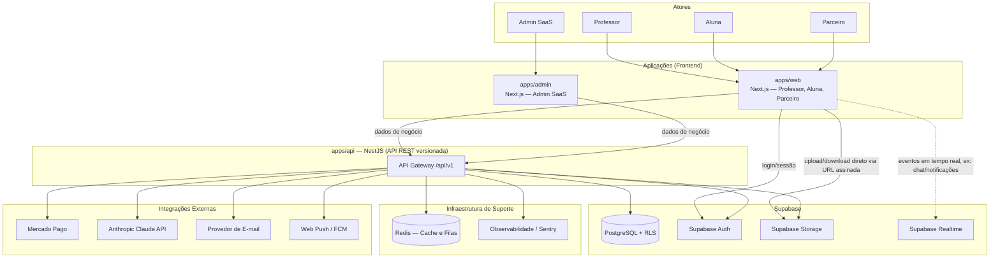
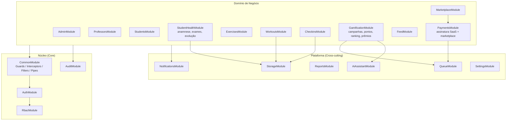
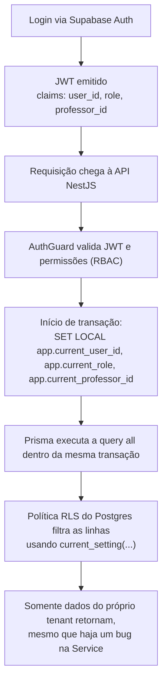
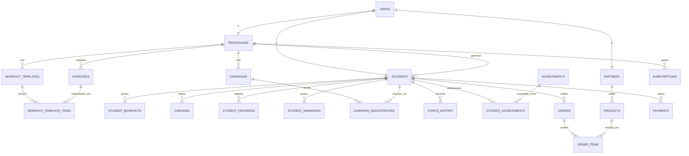
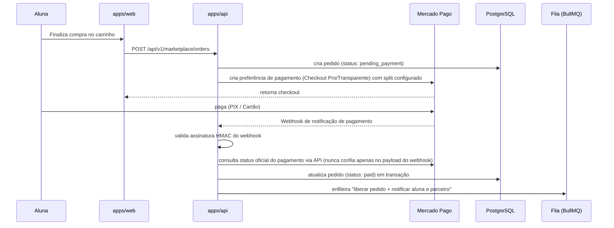
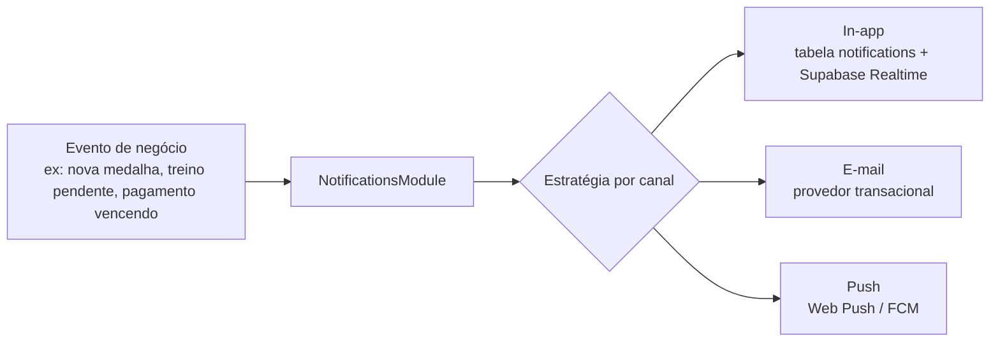
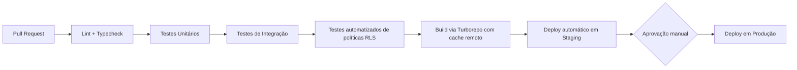
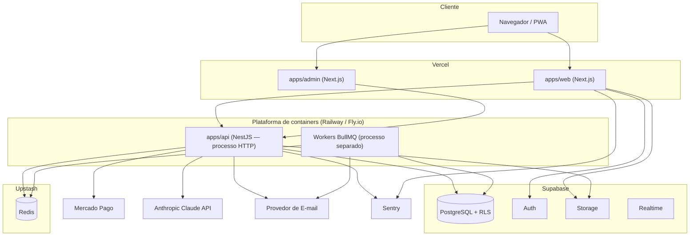

# ARQUITETURA DO SISTEMA — CLUBE DAS MUSAS

## 0. Papel deste documento

Este documento define a arquitetura técnica completa da plataforma Clube das Musas: como o sistema é dividido, como os componentes se comunicam, onde os dados sensíveis ficam protegidos e por que cada decisão foi tomada.

Este documento **não contém código**. Ele é a referência que qualquer desenvolvedor (humano ou IA) deve seguir antes de implementar qualquer módulo.

Toda decisão aqui é acompanhada de um **Motivo técnico**, conforme exigido pelo processo de desenvolvimento definido em [PROMPT_MESTRE.md](PROMPT_MESTRE.md).

---

## 1. Princípios Arquiteturais

Toda decisão de arquitetura deste projeto segue, nesta ordem de prioridade:

1. **Segurança** — nenhum dado de uma aluna ou professor pode vazar para outro tenant, sob nenhuma circunstância.
2. **Escalabilidade** — o sistema deve suportar milhares de professores e centenas de milhares de alunas sem redesenho estrutural.
3. **Organização e manutenibilidade** — qualquer módulo deve poder ser entendido, alterado ou extraído isoladamente.
4. **Performance** — consultas e fluxos críticos (dashboard, ranking, checkout) devem responder rapidamente mesmo em alta escala.
5. **Legibilidade** — código e estrutura devem ser óbvios para um novo desenvolvedor sem explicação verbal.

**Motivo técnico:** definir uma ordem de prioridade explícita evita decisões ambíguas durante a implementação (por exemplo, escolher a solução "mais rápida de implementar" em vez da "mais segura"). Sempre que houver conflito entre dois princípios, o de maior prioridade vence.

---

## 2. Visão Geral (Diagrama de Contexto)



**Motivo técnico:** o frontend nunca acessa o banco de dados diretamente para regras de negócio — isso é uma exigência explícita do [PROMPT_MESTRE.md](PROMPT_MESTRE.md) ("Nunca acessar diretamente o banco de dados pelo frontend"). As únicas exceções são chamadas diretas ao Supabase Auth (login/sessão) e Supabase Storage (upload/download via URL assinada de curta duração), que são serviços gerenciados com suas próprias políticas de segurança (RLS e Storage Policies), não acesso livre a tabelas de negócio.

---

## 3. Monorepo

### 3.1 Ferramentas

- **Gerenciador de pacotes:** `pnpm` (workspaces).
- **Orquestrador de build/tasks:** `Turborepo`.

**Motivo técnico:** `pnpm` evita duplicação de `node_modules` entre os múltiplos apps e packages (economiza espaço e tempo de instalação em CI). `Turborepo` foi escolhido em vez de `Nx` por ter configuração mais simples, integração nativa excelente com Next.js (mesma empresa, Vercel) e cache remoto de build — decisivo para manter o CI rápido conforme o monorepo cresce com múltiplos apps e packages.

### 3.2 Divisão em apps

O monorepo é dividido em **três aplicações**, e não em uma única aplicação com todos os perfis:

| App          | Responsável por            | Motivo da separação                                                                                                                                                                                                                                            |
| ------------ | -------------------------- | -------------------------------------------------------------------------------------------------------------------------------------------------------------------------------------------------------------------------------------------------------------- |
| `apps/web`   | Professor, Aluna, Parceiro | São perfis **externos/clientes**, compartilham o mesmo design system e temas (Luxo/Elegance), e se beneficiam de deploy conjunto.                                                                                                                              |
| `apps/admin` | Admin SaaS                 | É um perfil **interno da empresa**, com superfície de risco muito maior (acesso a todos os tenants). Isolar em app própria permite hardening adicional (MFA obrigatório, allowlist de IP, deploy e domínio separados) sem impactar a experiência dos clientes. |
| `apps/api`   | Toda a lógica de negócio   | Único ponto de acesso ao banco de dados e às integrações externas, usado por ambos os frontends.                                                                                                                                                               |

**Motivo técnico:** separar Admin do restante reduz o "raio de explosão" (blast radius) de um eventual comprometimento — uma vulnerabilidade de XSS ou dependência comprometida em `apps/web` (superfície pública, milhares de usuários) não expõe automaticamente o painel que tem visão de todos os tenants. Isso segue o princípio de segurança em camadas descrito na seção 12.

### 3.3 Packages compartilhados

| Package                  | Conteúdo                                                                                                            |
| ------------------------ | ------------------------------------------------------------------------------------------------------------------- |
| `packages/ui`            | Design system (componentes Shadcn/UI customizados, temas Luxo/Elegance, tokens visuais).                            |
| `packages/types`         | Tipos TypeScript e schemas Zod compartilhados entre API e frontends (DTOs, enums de status).                        |
| `packages/utils`         | Funções puras reutilizáveis (formatação, cálculos de pontuação, helpers de data).                                   |
| `packages/config`        | Configurações compartilhadas (ESLint, TSConfig, Tailwind, Prettier).                                                |
| `packages/database`      | Schema Prisma, migrations e client gerado — fonte única da verdade do banco.                                        |
| `packages/api-contracts` | Contratos de API gerados a partir do Swagger/OpenAPI da `apps/api` (cliente HTTP tipado consumido pelos frontends). |

**Motivo técnico do `packages/api-contracts`:** gerar o cliente HTTP automaticamente a partir da documentação Swagger (via ferramenta como `orval` ou `ts-rest`) elimina divergência manual entre o contrato do backend e o que o frontend espera — um erro comum em projetos onde o frontend escreve `fetch` calls manualmente e "esquece" de atualizar quando o backend muda um DTO.

---

## 4. Frontend

### 4.1 Stack

Next.js (App Router) + TypeScript + Tailwind CSS + Shadcn/UI + React Hook Form + Zod + TanStack Query + Zustand — conforme definido em [PROMPT_MESTRE.md](PROMPT_MESTRE.md).

### 4.2 Organização por perfil (segmentos de rota dedicados)

Dentro de `apps/web`, cada perfil autenticado vive sob seu próprio prefixo de URL, todos compartilhando o mesmo design system:

```
app/
  (public)/     → landing page, login, cadastro, recuperação de senha — route group, sem prefixo (/, /login...)
  professor/    → dashboard, alunas, exercícios, fichas, campanhas, feed, relatórios (/professor/...)
  aluna/        → início, treino, evolução, gamificação, feed, marketplace, pagamentos, perfil (/aluna/...)
  parceiro/     → dashboard, produtos, pedidos, avaliações, repasses (/parceiro/...)
```

**Motivo técnico:** `professor/`, `aluna/` e `parceiro/` são pastas de rota reais, não _route groups_ — a URL carrega o prefixo do perfil (`/professor/dashboard`, `/aluna/treino`). Isso é necessário por dois motivos: primeiro, route groups são invisíveis na URL, então duas telas de perfis diferentes com o mesmo nome (ex.: "feed" do professor e "feed" da aluna) colidiriam no mesmo caminho; segundo, o `proxy.ts` (antigo `middleware.ts`, renomeado no Next.js 16) que valida perfil/sessão por área depende de conseguir identificar a área pelo prefixo da URL — algo que route groups não permitem, por definição. `(public)` permanece como route group porque suas páginas devem ficar na raiz do domínio, sem prefixo, e não colidem com as áreas autenticadas.

### 4.3 Responsabilidades do frontend

- Renderização, formulários e validação **de experiência** (feedback imediato ao usuário).
- Toda validação do frontend é **redundante** — a validação real e definitiva ocorre sempre no backend (regra obrigatória do projeto).
- Estado de servidor gerenciado via TanStack Query (cache, refetch, invalidação).
- Estado de UI local (tema, filtros, modais) gerenciado via Zustand.

**Motivo técnico:** separar estado de servidor (TanStack Query) de estado de UI (Zustand) evita a armadilha comum de duplicar dados do servidor em um store global, o que causa dessincronização. Cada ferramenta resolve um problema diferente.

---

## 5. Backend

### 5.1 Estilo arquitetural: Monólito Modular

O backend é um **monólito modular** construído em NestJS — não uma arquitetura de microsserviços.

**Motivo técnico:** microsserviços resolvem problemas de escala organizacional (múltiplos times independentes) e de escala técnica assimétrica (um módulo precisa escalar 100x mais que outro). Nesta fase do produto, nenhum dos dois problemas existe. Um monólito modular bem desenhado no NestJS — com módulos de domínio isolados, comunicação interna por interfaces claras e sem acoplamento direto entre repositórios de módulos diferentes — sustenta a escala de "milhares de professores e centenas de milhares de alunas" no Postgres do Supabase sem dificuldade, com uma fração da complexidade operacional (deploy, observabilidade, transações distribuídas) de microsserviços. Os módulos são desenhados para serem **extraíveis no futuro** caso um domínio específico (ex.: Marketplace) precise, de fato, escalar isoladamente.

### 5.2 Módulos de domínio



**Motivo técnico:** o `StudentHealthModule` é separado do `StudentsModule` mesmo pertencendo conceitualmente à "aluna", porque armazena dados sensíveis de saúde (anamnese, exames, percentual de gordura, fotos de evolução). Isolar esse módulo permite aplicar políticas de acesso, logging e criptografia mais rígidas especificamente a ele, sem afetar o restante do cadastro da aluna — e facilita auditoria de conformidade com a LGPD (art. 11, dados sensíveis) por ter um limite de código bem definido.

### 5.3 Camadas dentro de cada módulo

Cada módulo de domínio segue estritamente:

```
Controller  → recebe a requisição HTTP, valida DTO, delega ao Service. Nunca contém regra de negócio.
Service     → contém toda a regra de negócio. Único lugar que decide "o que fazer".
Repository  → único lugar que fala com o Prisma/banco de dados.
DTO         → contrato de entrada/saída, validado com class-validator/Zod.
Guard       → decide "quem pode" antes do Controller ser executado.
Interceptor → cross-cutting concerns (logging, transformação de resposta, auditoria automática).
```

**Motivo técnico:** essa separação (já exigida no [PROMPT_MESTRE.md](PROMPT_MESTRE.md): "Nunca colocar regras de negócio dentro dos Controllers") garante que a lógica de negócio seja testável isoladamente (sem precisar simular uma requisição HTTP) e que trocar a fonte de dados (ex.: adicionar cache antes do banco) nunca exija tocar no Controller.

### 5.4 Versionamento e documentação

- Todas as rotas sob `/api/v1/`.
- Documentação automática via Swagger (`@nestjs/swagger`), gerando o contrato consumido por `packages/api-contracts`.

**Motivo técnico:** versionar a API desde o início evita quebrar `apps/web`/`apps/admin` quando uma mudança incompatível for necessária no futuro — basta introduzir `/api/v2/` para o recurso alterado, mantendo v1 funcionando durante a migração.

---

## 6. Banco de Dados

### 6.1 Estratégia de Multi-tenancy: Schema Compartilhado com RLS

Foi avaliadas três estratégias:

| Estratégia                                                                                  | Avaliação                                                                                                                                         |
| ------------------------------------------------------------------------------------------- | ------------------------------------------------------------------------------------------------------------------------------------------------- |
| Banco separado por tenant                                                                   | Isolamento máximo, porém inviável operacionalmente para milhares de professores (migrations, backups e monitoramento multiplicados por N).        |
| Schema separado por tenant (Postgres schemas)                                               | Melhor que banco separado, mas ainda gera overhead de manutenção de milhares de schemas e dificulta queries agregadas (ex.: relatórios do Admin). |
| **Schema único, compartilhado, com coluna de tenant (`professor_id`) + Row Level Security** | **Escolhido.**                                                                                                                                    |

**Motivo técnico:** com RLS nativo do Postgres/Supabase, o isolamento entre tenants é garantido **no nível do banco de dados**, não apenas na aplicação — atendendo à exigência do projeto de "nunca confiar apenas na aplicação". Um schema único também simplifica migrations (uma única execução afeta todos os tenants), permite índices compostos eficientes (`professor_id + created_at`) e possibilita consultas administrativas agregadas (necessárias para o Admin SaaS) sem precisar consultar N bancos separados.

### 6.2 Dupla camada de autorização (Defense in Depth)



**Motivo técnico:** mesmo que o backend acesse o Postgres com uma conexão de aplicação (via Prisma), cada requisição define variáveis de sessão Postgres (`SET LOCAL`) com a identidade do usuário autenticado antes de qualquer query, dentro da mesma transação. As políticas RLS de cada tabela leem essas variáveis (`current_setting('app.current_professor_id')`) para filtrar automaticamente os dados. Isso significa que **mesmo um bug de autorização em uma Service específica não vaza dados entre tenants** — o banco de dados aplica a regra de isolamento de forma independente da aplicação, exatamente como exige [10_AUTENTICACAO_E_SEGURANCA.md](10_AUTENTICACAO_E_SEGURANCA.md) ("Nenhuma tabela deverá ficar sem política de segurança").

### 6.3 ORM e Migrations

- **Prisma**, com schema único versionado em `packages/database`.

**Motivo técnico:** Prisma oferece tipagem end-to-end (o tipo do banco flui até o Service), migrations versionadas e revisáveis em PR, e integra-se bem ao padrão Repository do NestJS. A alternativa de usar o client `supabase-js` direto no backend foi descartada para lógica de negócio porque acopla o código a uma biblioteca específica de infraestrutura e dificulta testes unitários com mocks.

**Nota de implementação (Prisma 7):** a partir do Prisma 7, a connection string não fica mais declarada em `schema.prisma`. `packages/database` usa o gerador `prisma-client` (saída em `src/generated/prisma`) e conecta em runtime via _driver adapter_ (`@prisma/adapter-pg`), com a URL lida de `DATABASE_URL` em `packages/database/src/client.ts`. O `prisma.config.ts` mantém sua própria referência à URL, usada apenas pela CLI (migrate/studio), separada do client em runtime.

### 6.4 Modelo de dados (visão conceitual)



**Motivo técnico:** este é o modelo conceitual (nível de contexto), suficiente para validar os relacionamentos entre módulos antes da implementação. O schema físico completo (todas as ~45 tabelas listadas em [08_BANCO_DE_DADOS.md](08_BANCO_DE_DADOS.md), com colunas, tipos e índices) será formalizado no Prisma Schema durante a Fase 1/2 de implementação, não neste documento de arquitetura.

---

## 7. Storage

### 7.1 Buckets do Supabase Storage

| Bucket              | Visibilidade                                              | Conteúdo                                     | Padrão de path                                    |
| ------------------- | --------------------------------------------------------- | -------------------------------------------- | ------------------------------------------------- |
| `avatars`           | Público (somente leitura)                                 | Fotos de perfil                              | `{user_id}/avatar.webp`                           |
| `exercise-media`    | Privado, URL assinada                                     | Vídeos/thumbnails de exercícios              | `{professor_id}/{exercise_id}/{file}`             |
| `progress-photos`   | Privado, URL assinada, curta duração                      | Fotos de evolução física                     | `{professor_id}/{student_id}/{date}/{file}`       |
| `checkin-photos`    | Privado, URL assinada, curta duração                      | Fotos obrigatórias de conclusão de exercício | `{professor_id}/{student_id}/{checkin_id}/{file}` |
| `health-documents`  | Privado, URL assinada, curtíssima duração + log de acesso | Exames, anamnese em PDF                      | `{professor_id}/{student_id}/{file}`              |
| `marketplace-media` | Público (somente leitura)                                 | Imagens de produtos/serviços                 | `{partner_id}/{product_id}/{file}`                |
| `feed-media`        | Privado, escopado ao tenant                               | Imagens publicadas no feed                   | `{professor_id}/{post_id}/{file}`                 |

**Motivo técnico:** nenhum arquivo é salvo diretamente no banco de dados (exigência de [PROMPT_MESTRE.md](PROMPT_MESTRE.md)). Buckets são segmentados por **sensibilidade**, não apenas por tipo de arquivo — isso permite políticas de Storage RLS distintas por bucket (ex.: `health-documents` pode exigir MFA revalidado ou log obrigatório de todo acesso, enquanto `marketplace-media` é público por natureza). O padrão de path `{professor_id}/{student_id}/...` permite que as políticas de Storage do Supabase repliquem a mesma lógica de isolamento por tenant usada nas tabelas, usando o prefixo do caminho como filtro.

### 7.2 Upload

Todo upload passa pela `apps/api` (`StorageModule`) antes de gerar a URL assinada de destino, nunca é enviado livremente pelo cliente para um bucket sem validação prévia.

**Motivo técnico:** validar tipo real do arquivo (magic bytes), tamanho máximo e associação ao tenant correto **antes** de emitir a URL de upload impede que um usuário malicioso envie um executável disfarçado de imagem ou um arquivo maior que o permitido diretamente para o Storage.

---

## 8. Cache (Redis)

**Provedor:** Redis gerenciado (Upstash), compatível com ambientes serverless e containers.

### Casos de uso

| Uso                                     | Estrutura Redis                   | Justificativa                                                                                                                     |
| --------------------------------------- | --------------------------------- | --------------------------------------------------------------------------------------------------------------------------------- |
| Ranking de campanhas                    | Sorted Set (`ZADD`/`ZRANGE`)      | Rankings exigem leitura ordenada e frequente; recalcular via SQL a cada request seria caro em escala.                             |
| Cache de dashboard do professor         | String (JSON) com TTL curto       | Dashboard agrega múltiplas tabelas; cache de poucos segundos reduz carga sem prejudicar a atualidade percebida.                   |
| Rate limiting (login, checkout, IA)     | Contador com TTL                  | Necessário para proteção contra força bruta e flood, exigida em [10_AUTENTICACAO_E_SEGURANCA.md](10_AUTENTICACAO_E_SEGURANCA.md). |
| Idempotência de webhooks (Mercado Pago) | Chave única com TTL               | Evita processar o mesmo evento de pagamento duas vezes em caso de reentrega do webhook.                                           |
| Filas (BullMQ)                          | Listas/Streams internos do BullMQ | Redis é o backend nativo do BullMQ.                                                                                               |

**Motivo técnico:** reutilizar a mesma instância Redis para cache e para o backend das filas (seção 9) evita introduzir duas peças de infraestrutura separadas para necessidades correlatas, reduzindo custo e complexidade operacional.

---

## 9. Filas (Background Jobs)

**Ferramenta:** BullMQ sobre Redis, executado em workers dedicados dentro de `apps/api` (processo separado do processo HTTP).

### Jobs assíncronos

- Recalcular ranking e streak após check-in/conclusão de exercício.
- Processar webhook do Mercado Pago (confirmação de pagamento, liberação de pedido, split).
- Gerar resumo semanal e mensagens motivacionais da IA Assistente.
- Disparar notificações multi-canal (push/e-mail/in-app).
- Gerar relatórios/exportações pesadas (PDF/CSV) solicitados pelo professor.
- Processar upload de mídia (gerar thumbnail de vídeo de exercício).

**Motivo técnico:** operações que não precisam de resposta imediata ao usuário (recalcular ranking, enviar e-mail, gerar PDF) são movidas para fora do ciclo de requisição-resposta HTTP. Isso mantém as rotas da API rápidas e prossegue com o processamento pesado de forma resiliente (com retry automático em caso de falha), evitando timeout em ações como concluir um exercício ou finalizar uma compra.

**Nota:** a forma como módulos de domínio se comunicam entre si através dessas filas — via eventos de domínio nomeados, versionados e publicados através de um padrão Transactional Outbox — é detalhada em [05_ARQUITETURA_DE_EVENTOS.md](05_ARQUITETURA_DE_EVENTOS.md). Este documento aqui cobre apenas a infraestrutura de execução assíncrona; aquele cobre o desenho de comunicação desacoplada entre módulos.

---

## 10. Integrações Externas

### 10.1 Mercado Pago



**Motivo técnico:** o backend nunca confia apenas no conteúdo recebido no webhook — a assinatura HMAC é validada e, em seguida, o status é **reconfirmado diretamente na API do Mercado Pago** antes de liberar qualquer pedido. Isso segue exatamente a exigência de [PROMPT_MESTRE.md](PROMPT_MESTRE.md): "O backend deverá confirmar todos os pagamentos antes de liberar pedidos." O split de pagamento (plataforma/parceiro/professor) é configurado na criação da preferência, e todo cálculo de valores ocorre no backend, nunca no frontend.

### 10.2 IA Assistente (Anthropic Claude API)

- Chamadas feitas **exclusivamente pela `apps/api`** (`AiAssistantModule`), nunca pelo frontend — a chave de API nunca é exposta ao cliente.
- Todo conteúdo gerado pelo usuário que for incluído em um prompt (ex.: observações do professor) passa por sanitização antes do envio.
- Rate limiting dedicado por professor/aluna para conter custo e abuso.
- Sem acesso a fotos de evolução física — reforça a regra de que a IA nunca analisa imagens corporais nem substitui o professor.

**Motivo técnico:** centralizar a chamada de IA no backend permite auditoria, controle de custo, sanitização de entrada (mitigando risco de prompt injection) e troca futura de provedor sem impacto no frontend.

### 10.3 Notificações Multi-canal



**Motivo técnico:** o `NotificationsModule` usa o padrão _Strategy_, onde cada canal (in-app, e-mail, push) implementa a mesma interface de envio. Isso permite adicionar um novo canal (ex.: WhatsApp Business API no futuro) sem alterar o código que dispara as notificações — apenas registrando uma nova estratégia.

---

## 11. Observabilidade

| Camada                     | Ferramenta                                   | Propósito                                                                                                                              |
| -------------------------- | -------------------------------------------- | -------------------------------------------------------------------------------------------------------------------------------------- |
| Logs estruturados          | Pino (JSON)                                  | Permite busca e correlação de logs em produção.                                                                                        |
| Rastreamento de erros      | Sentry                                       | Alerta e agrupamento de exceções em frontend e backend.                                                                                |
| Auditoria de negócio       | `AuditModule` + tabela `audit_logs`          | Rastreabilidade de ações sensíveis (login, alteração de pagamento, exclusão), exigida em [08_BANCO_DE_DADOS.md](08_BANCO_DE_DADOS.md). |
| Métricas de infraestrutura | Métricas nativas da plataforma de hospedagem | Uso de CPU/memória, latência, taxa de erro por rota.                                                                                   |

**Motivo técnico:** logs técnicos (Pino/Sentry) e logs de auditoria de negócio (`audit_logs`) são propositalmente mantidos separados — o primeiro serve ao time de engenharia para depurar problemas, o segundo serve a compliance/LGPD e precisa de garantias de imutabilidade e retenção que um sistema de log técnico não oferece.

---

## 12. Segurança em Camadas (Defense in Depth)

1. **Frontend:** validação de experiência (Zod/React Hook Form) — nunca é a linha de defesa real.
2. **API Gateway (Guards):** autenticação (JWT do Supabase Auth) + autorização (RBAC) antes de qualquer Controller executar.
3. **Service:** valida vínculo de negócio (ex.: "esta ficha pertence a esta aluna?") além do RBAC genérico.
4. **Banco de Dados (RLS):** aplica isolamento de tenant independentemente da aplicação, como rede de segurança final.
5. **Storage Policies:** replicam a mesma lógica de isolamento para arquivos.
6. **Rate Limiting + Auditoria:** contêm abuso e garantem rastreabilidade.

**Motivo técnico:** nenhuma camada individual é responsável por garantir segurança sozinha. Essa redundância intencional (também chamada _defense in depth_) significa que uma falha em uma camada (ex.: um bug de autorização em uma Service) não resulta automaticamente em vazamento de dados, porque a camada seguinte (RLS) ainda bloqueia o acesso indevido.

---

## 13. CI/CD e Ambientes

### 13.1 Ambientes

Três ambientes totalmente isolados, cada um com seu próprio projeto Supabase (banco, auth e storage independentes): `development`, `staging`, `production`.

**Motivo técnico:** isolar os dados por ambiente evita que testes em `staging` afetem dados reais de professores/alunas, e permite testar migrations de banco com segurança antes de aplicá-las em produção.

### 13.2 Pipeline (GitHub Actions)



**Motivo técnico:** testes de política RLS são uma etapa **obrigatória e isolada** no pipeline (não apenas testes de unidade) porque a segurança de isolamento entre tenants depende diretamente dessas políticas — um erro de RLS é, por definição, um vazamento de dados entre professores ou alunas, o risco mais crítico identificado na análise deste projeto.

---

## 14. Deployment / Infraestrutura



**Motivo técnico:** `apps/web` e `apps/admin` são hospedadas na Vercel por serem aplicações Next.js — aproveitando edge network, preview deployments por PR e otimizações nativas de imagem/SSR. Já `apps/api` **não** é hospedada como funções serverless: os workers do BullMQ e conexões de longa duração (ex.: processamento de webhooks, filas) exigem um processo Node persistente, algo que a execução serverless da Vercel não atende bem. Por isso a API roda em uma plataforma de containers (Railway ou Fly.io), com o processo HTTP e os workers de fila escaláveis de forma independente.

---

## 15. Resumo das Decisões Arquiteturais (ADR)

| #   | Decisão                                                                          | Alternativas consideradas                                                                    | Motivo da escolha                                                                                                                                                                                                            |
| --- | -------------------------------------------------------------------------------- | -------------------------------------------------------------------------------------------- | ---------------------------------------------------------------------------------------------------------------------------------------------------------------------------------------------------------------------------- |
| 1   | Monorepo com pnpm + Turborepo                                                    | Nx, múltiplos repositórios                                                                   | Simplicidade, cache remoto, integração nativa com Next.js                                                                                                                                                                    |
| 2   | 3 apps (web, admin, api) em vez de 1 app único                                   | App único com todos os perfis                                                                | Isolamento de risco do Admin; separação de ciclo de deploy                                                                                                                                                                   |
| 3   | Backend monólito modular (NestJS)                                                | Microsserviços                                                                               | Complexidade operacional injustificada na escala atual; módulos extraíveis no futuro                                                                                                                                         |
| 4   | Multi-tenancy via schema único + RLS                                             | Banco/schema por tenant                                                                      | Escalabilidade operacional; RLS garante isolamento no nível do banco                                                                                                                                                         |
| 5   | Prisma como ORM                                                                  | Supabase-js direto no backend, Drizzle                                                       | Tipagem end-to-end, testabilidade, migrations versionadas                                                                                                                                                                    |
| 6   | Session variables (`SET LOCAL`) + RLS em toda query                              | Confiar somente em filtros `WHERE` na aplicação                                              | Defesa em profundidade — bug de autorização não vaza dados                                                                                                                                                                   |
| 7   | Redis único para cache e filas (BullMQ)                                          | Ferramentas separadas                                                                        | Reduz peças de infraestrutura sem perda de funcionalidade                                                                                                                                                                    |
| 8   | IA chamada apenas pelo backend                                                   | IA chamada direto do frontend                                                                | Proteção da chave de API, sanitização, rate limiting, auditoria                                                                                                                                                              |
| 9   | Webhook do Mercado Pago sempre reconfirmado via API                              | Confiar no payload do webhook                                                                | Exigência explícita do projeto contra fraude de pagamento                                                                                                                                                                    |
| 10  | `apps/api` em containers, não serverless                                         | Vercel Functions                                                                             | Workers de fila exigem processo persistente                                                                                                                                                                                  |
| 11  | Comunicação entre módulos via eventos de domínio (Transactional Outbox + BullMQ) | Chamadas diretas entre Services de módulos diferentes; message broker externo desde o início | Desacopla módulos sem custo de infraestrutura prematura; garante entrega mesmo em falha; preserva caminho de extração futura para microsserviços — detalhado em [05_ARQUITETURA_DE_EVENTOS.md](05_ARQUITETURA_DE_EVENTOS.md) |

---

Este documento deve ser revisado sempre que uma decisão arquitetural relevante mudar. A estrutura de pastas correspondente a esta arquitetura está detalhada em [01_ESTRUTURA_DO_PROJETO.md](01_ESTRUTURA_DO_PROJETO.md), o modelo de negócio em [02_MODELO_DE_NEGOCIO.md](02_MODELO_DE_NEGOCIO.md), as regras de negócio em [03_REGRAS_DE_NEGOCIO.md](03_REGRAS_DE_NEGOCIO.md), o modelo de dados completo em [04_MODELO_DE_DADOS.md](04_MODELO_DE_DADOS.md) e a arquitetura de eventos em [05_ARQUITETURA_DE_EVENTOS.md](05_ARQUITETURA_DE_EVENTOS.md).
