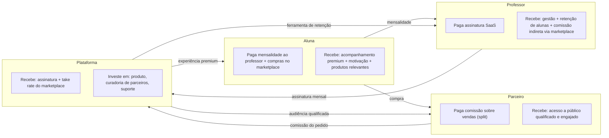

# MODELO DE NEGÓCIO — CLUBE DAS MUSAS

## 0. Papel deste documento

Este documento define **por que** a plataforma existe, **para quem** ela existe e **como** ela gera receita. Toda decisão de produto e arquitetura documentada em [00_ARQUITETURA.md](00_ARQUITETURA.md) deve servir a este modelo de negócio — não o contrário.

---

## 1. Proposta de Valor

> **Clube das Musas é a plataforma que transforma o acompanhamento de alunas por personal trainers em uma experiência premium, gamificada e orientada a retenção.**

O problema central que a plataforma resolve não é "gerenciar fichas de treino" — isso já é resolvido por dezenas de apps genéricos do mercado. O problema real é **o churn (cancelamento) de alunas**, que é a principal causa de perda de receita de um professor autônomo. Alunas cancelam quando perdem a motivação, sentem-se sozinhas no processo ou não enxergam evolução.

O Clube das Musas ataca esse problema por três frentes simultâneas:

1. **Gestão profissional** para o professor (menos tempo em planilhas e WhatsApp, mais tempo com a aluna).
2. **Gamificação e comunidade** para a aluna (motivação constante, senso de progresso, pertencimento a um "clube").
3. **Monetização adicional** via Marketplace, conectando alunas a produtos e serviços relevantes ao seu objetivo.

**Motivo técnico/estratégico:** esse enquadramento (retenção como problema central, não gestão) orienta prioridades de produto — por exemplo, justifica por que a Gamificação (Fase 5 do plano) é tão importante quanto o núcleo de gestão (Fase 2), e por que o Marketplace (Fase 8) é uma fonte de receita adicional, não o produto principal.

---

## 2. Público-Alvo

### 2.1 Professor (cliente direto / pagante da assinatura SaaS)

- Personal trainers e profissionais de educação física, majoritariamente atendendo público feminino (alinhado à identidade "Clube das Musas": elegância, exclusividade, feminilidade).
- Já possui uma carteira de alunas (presencial, online ou híbrido) e busca profissionalizar o acompanhamento.
- Sensível a ferramentas que reduzam trabalho manual (planilhas, WhatsApp) e aumentem a permanência das alunas.
- Perfil de maturidade digital variável — por isso a exigência de UX extremamente simples ("teste dos 30 segundos") definida em [PROMPT_MESTRE.md](PROMPT_MESTRE.md).

### 2.2 Aluna (usuária final do professor)

- Mulheres que treinam com acompanhamento personalizado, buscando resultado físico, constância e motivação.
- Já paga o professor por um serviço (presencial ou online) — a plataforma é onde ela vive essa jornada.
- Motivada por reconhecimento, progresso visível e comunidade, não apenas por dados técnicos de treino.

### 2.3 Parceiro (fornecedor de produtos/serviços do Marketplace)

- Marcas e prestadores de serviço relacionados ao público fitness/bem-estar feminino: suplementação, moda fitness, estética, nutrição, fotografia de evolução, entre outros.
- Busca acesso a um público qualificado e já engajado (alunas ativas de professores parceiros), com menor custo de aquisição do que canais abertos.

### 2.4 Admin SaaS (operador da plataforma)

- Equipe do Clube das Musas responsável por curadoria de parceiros, saúde financeira da plataforma e suporte aos professores.

---

## 3. Como Cada Perfil Gera e Recebe Valor

**Motivo técnico:** este é um modelo de **múltiplos lados** (multi-sided platform) — o valor cresce com o número de participantes de cada lado (efeito de rede: mais professores atraem mais alunas, o que atrai mais parceiros, o que gera mais prêmios/parcerias atrativas para os professores). Esse entendimento justifica investir cedo em Gamificação e Marketplace, mesmo sendo módulos "não essenciais" para uma gestão básica de treinos — eles são o que faz o efeito de rede funcionar.

---

## 4. Modelo de Receita (SaaS)

A plataforma tem **duas fontes de receita primárias** e uma opcional:

| Fonte                                                         | Quem paga | Modelo                                                                                                                                                            | Prioridade                                                                                |
| ------------------------------------------------------------- | --------- | ----------------------------------------------------------------------------------------------------------------------------------------------------------------- | ----------------------------------------------------------------------------------------- |
| **Assinatura SaaS**                                           | Professor | Recorrência mensal/anual, por plano (baseado em nº de alunas ativas e funcionalidades)                                                                            | Principal                                                                                 |
| **Take rate do Marketplace**                                  | Parceiro  | Percentual sobre cada venda, descontado automaticamente via split de pagamento do Mercado Pago                                                                    | Secundária, mas estratégica para o efeito de rede                                         |
| **Fee sobre mensalidade da aluna** _(opcional, configurável)_ | Professor | Percentual sobre pagamentos de mensalidade processados na plataforma (quando o professor optar por usar o Clube das Musas como meio de cobrança da própria aluna) | Opcional — depende de o professor optar por processar a cobrança da aluna pela plataforma |

**Motivo técnico:** o split de pagamento do Mercado Pago (já definido na arquitetura, seção 10.1 de [00_ARQUITETURA.md](00_ARQUITETURA.md)) foi desenhado para suportar três destinatários simultâneos (plataforma, parceiro, professor) exatamente para viabilizar essas três fontes de receita sem processamento manual.

---

## 5. Planos de Assinatura (Professor)

| Plano            | Público-alvo                                                         | Limite de alunas ativas | Funcionalidades incluídas                                                                                                   |
| ---------------- | -------------------------------------------------------------------- | ----------------------- | --------------------------------------------------------------------------------------------------------------------------- |
| **Essencial**    | Professor iniciando a digitalização do atendimento                   | Até 20 alunas           | Cadastro de alunas, exercícios, fichas de treino, check-in, evolução física, feed básico                                    |
| **Profissional** | Professor com carteira estabelecida                                  | Até 100 alunas          | Tudo do Essencial + Gamificação completa (campanhas, ranking, medalhas, prêmios) + relatórios avançados + IA Assistente     |
| **Elite**        | Professor com operação madura ou estúdio com múltiplos profissionais | Alunas ilimitadas       | Tudo do Profissional + múltiplos assistentes com permissões (RBAC granular) + destaque no Marketplace + suporte prioritário |

Todos os planos incluem: dois temas visuais (Luxo/Elegance), app responsivo completo para a aluna, segurança e conformidade LGPD.

**Motivo técnico:** a métrica de limite ("alunas ativas") foi escolhida como eixo de precificação — em vez de, por exemplo, "número de professores" ou "recursos" isolados — porque acompanha diretamente o valor que o professor extrai da plataforma (mais alunas = mais uso = mais disposição a pagar), e porque é uma métrica que o próprio sistema já precisa calcular para o dashboard do professor (`total de alunas ativas`, já especificado em [PROMPT_MESTRE.md](PROMPT_MESTRE.md)), evitando lógica de billing paralela e desconectada do produto.

### 5.1 Aquisição

- **Trial gratuito de 14 dias** no plano Profissional, sem necessidade de cartão de crédito, para reduzir fricção de adoção.
- Após o trial, o professor escolhe um plano ou é automaticamente reduzido a uma versão gratuita muito limitada (ex.: até 5 alunas, sem gamificação), evitando perda total de acesso e mantendo caminho de conversão futura.

**Motivo técnico:** manter uma camada gratuita mínima (freemium) em vez de bloquear o acesso após o trial reduz o custo de reaquisição — o professor não perde os dados já cadastrados e pode ser reengajado por campanhas de upgrade.

---

## 6. Métricas-Chave do Negócio

Estas métricas devem ser visíveis no dashboard do **Admin SaaS** (já previsto em [PROMPT_MESTRE.md](PROMPT_MESTRE.md) como "visualizar estatísticas gerais"):

| Métrica                         | O que mede                                                                                                    |
| ------------------------------- | ------------------------------------------------------------------------------------------------------------- |
| MRR (Monthly Recurring Revenue) | Receita recorrente mensal de assinaturas                                                                      |
| Churn de professores            | Taxa de cancelamento de assinatura SaaS                                                                       |
| Churn de alunas                 | Taxa de inatividade/cancelamento de alunas por professor — **proxy direto do valor entregue pela plataforma** |
| GMV do Marketplace              | Volume total transacionado entre alunas e parceiros                                                           |
| Take rate efetivo               | Receita de comissão / GMV do Marketplace                                                                      |
| Ativação                        | % de professores que completam o cadastro de pelo menos 1 aluna e 1 ficha de treino nos primeiros 7 dias      |
| Engajamento da aluna            | Frequência de check-ins/semana, uso de gamificação                                                            |

**Motivo técnico:** "Churn de alunas" é destacado como a métrica mais importante do produto porque ela mede diretamente a eficácia da proposta de valor central (seção 1) — diferente de métricas de vaidade (ex.: número de logins), ela correlaciona-se com o motivo pelo qual um professor continuaria pagando a assinatura.

---

## 7. Posicionamento de Marca

A marca deve ser percebida como **premium, exclusiva e feminina**, nunca como "mais um app de academia". Isso se reflete diretamente nas decisões de UX/UI já definidas em [PROMPT_MESTRE.md](PROMPT_MESTRE.md) (paleta preto/dourado, temas Luxo/Elegance, ausência de interface "genérica de painel administrativo") e reforça a escolha de nomear a jornada da aluna como parte de um **clube** — linguagem de pertencimento e exclusividade, não apenas de utilidade funcional.

---

Este modelo de negócio deve ser revisitado sempre que uma nova fonte de receita, plano ou segmento de público for considerado, e serve de base para as regras detalhadas em [03_REGRAS_DE_NEGOCIO.md](03_REGRAS_DE_NEGOCIO.md).
