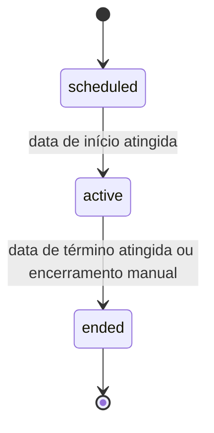
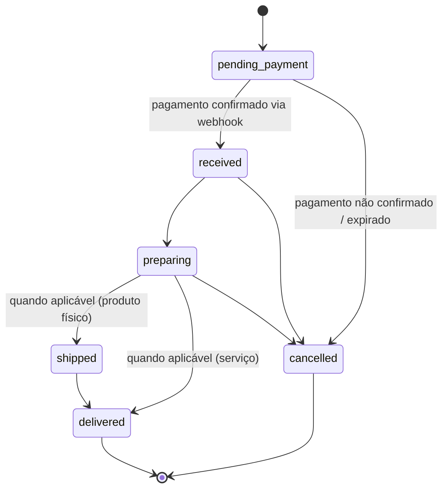

# REGRAS DE NEGÓCIO — CLUBE DAS MUSAS

## 0. Papel deste documento

Este documento formaliza as regras de negócio que o sistema **precisa** respeitar, independentemente de camada (frontend, backend ou banco). Toda regra aqui listada deve ser validada obrigatoriamente no backend, conforme exigido em [PROMPT_MESTRE.md](PROMPT_MESTRE.md) — o frontend pode replicá-la apenas para dar feedback imediato ao usuário.

Estas regras serão traduzidas em Guards, Services e Constraints de banco durante a implementação — este documento não contém código, apenas a especificação da regra.

---

## 1. Matriz de Permissões por Perfil

Legenda: **Total** = acesso irrestrito · **Próprio** = apenas registros vinculados ao próprio tenant/perfil · **Leitura** = somente visualização · **Não** = sem acesso.

| Recurso / Ação                                | Admin   | Professor                       | Aluna                           | Parceiro                       |
| --------------------------------------------- | ------- | ------------------------------- | ------------------------------- | ------------------------------ |
| Gerenciar professores (criar/bloquear/planos) | Total   | Não                             | Não                             | Não                            |
| Aprovar/reprovar parceiros                    | Total   | Não                             | Não                             | Não                            |
| Visualizar estatísticas globais da plataforma | Total   | Não                             | Não                             | Não                            |
| Cadastrar/editar alunas                       | Não     | Próprio                         | Não (somente próprio perfil)    | Não                            |
| Visualizar dados de saúde (anamnese/exames)   | Não*    | Próprio (suas alunas)           | Próprio (seus próprios dados)   | Não                            |
| Criar exercícios e fichas de treino           | Não     | Próprio                         | Não                             | Não                            |
| Visualizar/concluir ficha de treino           | Não     | Próprio (suas alunas)           | Próprio                         | Não                            |
| Criar campanhas e regras de pontuação         | Não     | Próprio                         | Não                             | Não                            |
| Inscrever-se em campanhas                     | Não     | Não                             | Próprio                         | Não                            |
| Conceder prêmios manualmente                  | Não     | Próprio                         | Não                             | Não                            |
| Resgatar prêmios                              | Não     | Não                             | Próprio                         | Não                            |
| Publicar no feed                              | Não     | Próprio                         | Não (somente visualizar/reagir) | Não                            |
| Cadastrar produtos/serviços                   | Não     | Não                             | Não                             | Próprio                        |
| Comprar no marketplace                        | Não     | Não                             | Próprio                         | Não                            |
| Gerenciar pedidos recebidos                   | Não     | Não                             | Não                             | Próprio                        |
| Avaliar compras                               | Não     | Não                             | Próprio                         | Não (pode responder avaliação) |
| Visualizar pagamentos próprios                | Total   | Próprio (assinatura + repasses) | Próprio (mensalidade + compras) | Próprio (repasses)             |
| Visualizar relatórios                         | Total   | Próprio                         | Não                             | Próprio (limitado a vendas)    |
| Configurar tema (Luxo/Elegance)               | Próprio | Próprio                         | Próprio                         | Próprio                        |
| Visualizar logs de auditoria                  | Total   | Não                             | Não                             | Não                            |

\* O Admin não acessa dados de saúde de alunas por padrão — apenas metadados operacionais (contagem, status). Acesso a conteúdo de saúde específico exige justificativa registrada em auditoria (ex.: solicitação de suporte formal), nunca navegação livre.

**Motivo técnico:** mesmo o Admin — perfil de maior privilégio — não tem acesso irrestrito a dados de saúde por padrão. Isso é uma decisão deliberada de minimização de acesso (princípio de _least privilege_ e exigência de proteção especial da LGPD para dados sensíveis, conforme [10_AUTENTICACAO_E_SEGURANCA.md](10_AUTENTICACAO_E_SEGURANCA.md)), não um esquecimento.

---

## 2. Regras de Treinos

1. Uma ficha de treino (`student_workouts`) é sempre derivada de um modelo (`workout_templates`) **ou** criada do zero, mas pertence exclusivamente a uma aluna e a um professor.
2. Alterar um modelo (`workout_templates`) **nunca** altera fichas já atribuídas a alunas — a ficha é uma cópia independente no momento da atribuição.
3. Um exercício só pode ser marcado como concluído (`workout_history`) mediante envio obrigatório de foto. Sem foto, o exercício permanece com status `pending`, mesmo que todos os campos numéricos (séries, repetições, carga) tenham sido preenchidos.
4. Essa validação (regra 3) é obrigatoriamente reforçada no backend — o endpoint de conclusão de exercício rejeita a requisição (HTTP 422) se não houver referência de foto válida associada.
5. Uma aluna só pode concluir exercícios da própria ficha ativa.
6. Um exercício só pode pertencer à biblioteca de um único professor — nunca é compartilhado entre professores.

---

## 3. Regras de Check-in

1. O check-in diário é **automático**, não uma ação manual isolada: ocorre no momento em que a aluna conclui pelo menos um exercício válido no dia.
2. Apenas **um check-in por aluna por dia** é permitido (chave única `student_id + date`). Concluir múltiplos exercícios no mesmo dia gera um único check-in, não múltiplos.
3. A sequência de dias treinando (_streak_) é incrementada apenas em dias consecutivos com check-in; a ausência de um dia zera a sequência atual (mas não apaga o histórico).
4. O fuso horário de referência para "o dia" é o fuso horário configurado no perfil do professor (ou padrão `America/Sao_Paulo`), garantindo consistência para alunas e professor que compartilham a mesma operação.

---

## 4. Regras de Pontuação

1. Pontos só podem ser criados através de um **evento de origem identificável** (check-in, exercício concluído, sequência, foto de evolução, desafio, bônus manual, aniversário) — nunca um ajuste de pontuação "solto" sem motivo registrado.
2. Toda concessão ou remoção de pontos gera um registro imutável em `points_history`, referenciando o evento de origem. Pontos **nunca são editados diretamente** — apenas compensados por um novo registro (ex.: um estorno gera um registro negativo com motivo `correction`, preservando o histórico original).
3. Bônus manuais concedidos pelo professor exigem justificativa textual obrigatória, também registrada em `points_history`.
4. Cada regra de pontuação (quantos pontos vale cada evento) é configurável por professor e por campanha — nunca fixa no código, conforme exigido em [PROMPT_MESTRE.md](PROMPT_MESTRE.md).
5. Existem **dois tipos de pontuação simultâneos**:
   - **Pontos vitalícios** (não resetam) — usados para o sistema de Níveis (seção 5).
   - **Pontos de campanha** (escopados a uma campanha específica, podem resetar ao fim do período) — usados para o Ranking daquela campanha.

**Motivo técnico:** separar pontos vitalícios de pontos de campanha resolve uma tensão de produto: campanhas precisam de um "placar zerado" para manter competições justas e recorrentes, mas a plataforma também quer recompensar constância de longo prazo (retenção). Um único contador de pontos não atenderia aos dois objetivos simultaneamente.

---

## 5. Níveis e Progressão

1. O **Nível** da aluna é calculado a partir da soma de **pontos vitalícios** (histórico completo, nunca reiniciado).
2. A progressão de nível segue uma curva crescente (cada nível exige mais pontos que o anterior), para que o esforço de progressão permaneça significativo mesmo após meses de uso.
3. Alcançar um novo nível dispara automaticamente:
   - Uma notificação de celebração para a aluna.
   - Uma publicação automática no feed (mediante as mesmas regras de autorização de fotos, se aplicável).
   - Potencialmente o desbloqueio de uma conquista associada àquele nível (ex.: Nível 5 = medalha "Musa Dedicada").
4. O Nível é uma métrica **da plataforma como um todo** para aquela aluna (não reseta por campanha), enquanto o Ranking (seção 7) é sempre contextual a uma campanha específica.

---

## 6. Conquistas (Achievements)

1. Cada conquista possui critério de desbloqueio verificável automaticamente pelo sistema (ex.: "7 dias seguidos", "100 exercícios concluídos") — nunca concedida manualmente fora desse critério, para preservar o valor simbólico da conquista.
2. Uma conquista é desbloqueada **uma única vez** por aluna (idempotente) — o sistema deve impedir duplicidade mesmo se o evento que a dispara ocorrer mais de uma vez.
3. Conquistas desbloqueadas ficam permanentemente visíveis no perfil da aluna, mesmo que a campanha relacionada (se houver) já tenha encerrado.

---

## 7. Ranking

1. O ranking é sempre **contextual a uma campanha ativa** — não existe "ranking geral" fora do contexto de uma campanha, pois pontos de campanha são o que alimentam o ranking.
2. Critério de desempate: maior pontuação vence; em caso de empate exato, prevalece quem atingiu a pontuação primeiro (`points_history.created_at` mais antigo).
3. O professor decide, por campanha, se o ranking é **público** (visível a todas as inscritas) ou **privado** (visível apenas ao professor).
4. O ranking é recalculado de forma assíncrona a cada evento de pontuação relevante (ver [05_ARQUITETURA_DE_EVENTOS.md](05_ARQUITETURA_DE_EVENTOS.md)), nunca de forma síncrona bloqueando a ação da aluna.

---

## 8. Desafios e Campanhas

1. Uma campanha possui três estados possíveis: `scheduled` (agendada), `active` (ativa) e `ended` (encerrada) — transições sempre nessa ordem, nunca retroativas.

2. Inscrições (`campaign_registrations`) só são aceitas enquanto a campanha está em `scheduled`. Após transicionar para `active`, novas inscrições são bloqueadas automaticamente pelo backend, e o sistema deve informar a aluna que ela poderá participar apenas da próxima campanha.
3. Desafios (ex.: metas específicas dentro de uma campanha, como "treinar 5 vezes esta semana") são modelados como regras adicionais de pontuação (`campaign_rules`) com um `event_type` próprio, não como uma entidade totalmente separada — evita duplicar a lógica de concessão de pontos.

---

## 9. Marketplace e Pedidos

1. Um pedido percorre obrigatoriamente os estados abaixo, sempre nesta ordem (exceto cancelamento, que pode ocorrer a partir de `received` ou `preparing`):

2. Um pedido só avança para `received` mediante confirmação **do backend consultando diretamente a API do Mercado Pago** — nunca a partir do retorno de navegação do frontend nem apenas do payload do webhook, conforme já definido em [00_ARQUITETURA.md](00_ARQUITETURA.md#101-mercado-pago).
3. Avaliações (`reviews`) só podem ser criadas após o pedido atingir `delivered`, e uma única avaliação por pedido é permitida.
4. Estoque de produtos é decrementado apenas na confirmação de pagamento (`received`), nunca na criação do pedido (`pending_payment`) — evita reservar estoque indefinidamente para pedidos nunca pagos.

---

## 10. Pagamentos

### 10.1 Assinatura SaaS (Professor → Plataforma)

1. Estados possíveis: `trialing`, `active`, `past_due`, `cancelled`.
2. Ao entrar em `past_due` (falha de cobrança), o professor mantém acesso por um período de tolerância (ex.: 5 dias) antes de qualquer restrição de funcionalidade — nunca um bloqueio imediato, para evitar perda de dados de alunas por uma falha pontual de cartão.
3. Ultrapassado o período de tolerância sem regularização, o acesso é restringido a modo leitura (professor pode visualizar dados, mas não criar novos registros) até a regularização.

### 10.2 Mensalidade (Aluna → Professor)

1. É o professor quem define o valor e vencimento da mensalidade de cada aluna — a plataforma não impõe um valor.
2. O status de pagamento da aluna (`em dia`, `próximo do vencimento`, `inadimplente`) é refletido automaticamente no dashboard do professor, sem ação manual.

### 10.3 Marketplace (Aluna → Parceiro, com split)

1. Todo cálculo de valores (subtotal, comissão da plataforma, repasse ao parceiro, repasse ao professor quando configurado) ocorre **exclusivamente no backend**, nunca no frontend — conforme exigido em [PROMPT_MESTRE.md](PROMPT_MESTRE.md).
2. O percentual de split é definido por categoria de parceiro e/ou por acordo comercial individual, nunca hardcoded por pedido.

---

## 11. Cancelamentos e Reembolsos

1. **Cancelamento de aluna pelo professor:** a aluna é movida para status `inactive` (soft delete lógico) — seu histórico de treinos, evolução e pagamentos é preservado, nunca excluído fisicamente, conforme [08_BANCO_DE_DADOS.md](08_BANCO_DE_DADOS.md).
2. **Cancelamento de assinatura pelo professor:** o cancelamento é sempre agendado para o fim do período já pago (`cancel_at_period_end`), nunca imediato, preservando o valor já pago pelo professor.
3. **Cancelamento de pedido do marketplace:** só é permitido nos estados `received` ou `preparing` (ver diagrama da seção 9). Após `shipped`, o cancelamento deve seguir política de devolução do parceiro, fora do escopo automático do sistema.
4. **Reembolsos** de pagamentos via Mercado Pago são sempre processados através da API oficial (nunca "simulados" no banco de dados sem uma transação real correspondente), e o registro do reembolso gera uma entrada em `payment_history` para auditoria.

---

## 12. Notificações

Regras de disparo (detalhamento completo do fluxo assíncrono em [05_ARQUITETURA_DE_EVENTOS.md](05_ARQUITETURA_DE_EVENTOS.md)):

| Evento                              | Destinatário                                                                                  | Canal padrão    |
| ----------------------------------- | --------------------------------------------------------------------------------------------- | --------------- |
| Treino atribuído                    | Aluna                                                                                         | In-app + Push   |
| Exercício concluído                 | — (apenas reflete no dashboard do professor, sem notificação individual para não gerar ruído) | —               |
| Conquista desbloqueada              | Aluna                                                                                         | In-app + Push   |
| Mudança de nível                    | Aluna                                                                                         | In-app + Push   |
| Nova campanha disponível            | Alunas do professor                                                                           | In-app + E-mail |
| Aluna sem treinar há mais de 7 dias | Professor                                                                                     | In-app + E-mail |
| Pagamento próximo do vencimento     | Aluna                                                                                         | In-app + Push   |
| Pagamento confirmado (marketplace)  | Aluna e Parceiro                                                                              | In-app + E-mail |
| Pedido com status alterado          | Aluna                                                                                         | In-app + Push   |
| Parceiro aprovado/reprovado         | Parceiro                                                                                      | E-mail          |
| Assinatura com pagamento recusado   | Professor                                                                                     | In-app + E-mail |

1. Toda notificação respeita preferências mínimas de opt-out do usuário (nunca é possível desativar notificações críticas de segurança, como alteração de senha, mas é possível desativar notificações motivacionais/marketing).
2. Nenhuma notificação pode conter dados sensíveis de saúde no corpo da mensagem (ex.: e-mail nunca cita percentual de gordura ou conteúdo de anamnese) — apenas um convite genérico para acessar a plataforma.

**Motivo técnico:** a regra 2 evita vazamento de dados sensíveis através de um canal que a plataforma não controla totalmente (caixas de e-mail podem ser compartilhadas, notificações push aparecem na tela de bloqueio do celular) — coerente com a exigência de proteção especial a dados de saúde de [10_AUTENTICACAO_E_SEGURANCA.md](10_AUTENTICACAO_E_SEGURANCA.md).

---

## 13. Regras Gerais de Dados Sensíveis e LGPD

1. Fotos de evolução física, exames e anamnese nunca são analisadas por Inteligência Artificial, sob nenhuma circunstância — regra absoluta, sem exceção configurável.
2. Toda aluna pode solicitar exportação dos próprios dados (LGPD) através de uma ação no perfil, que gera um pacote de dados processado de forma assíncrona (fila) e disponibilizado por link temporário.
3. Exclusão de conta, quando permitida por lei, segue anonimização dos dados pessoais identificáveis mantendo apenas registros financeiros/fiscais exigidos por obrigação legal (que têm base legal própria para retenção, independente de LGPD).

---

Este documento é normativo: qualquer implementação que divirja de uma regra aqui descrita deve ser tratada como bug, não como interpretação alternativa. Alterações de regra exigem atualização deste documento antes da alteração de código.
