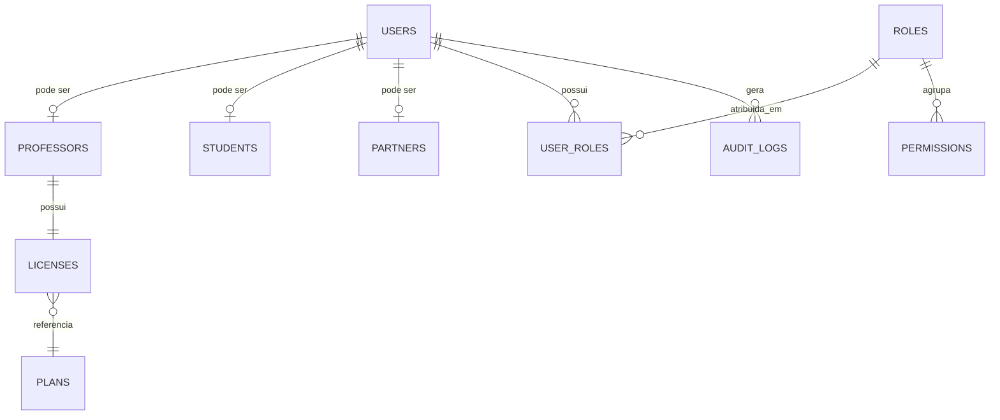
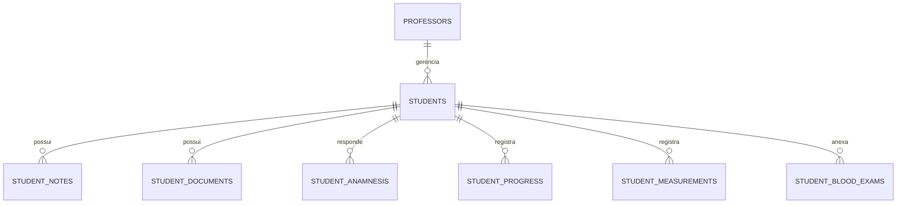
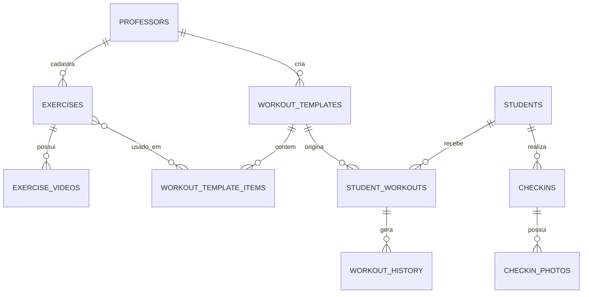
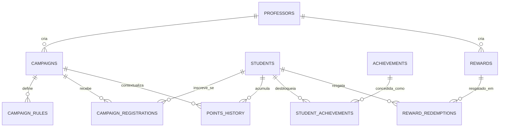
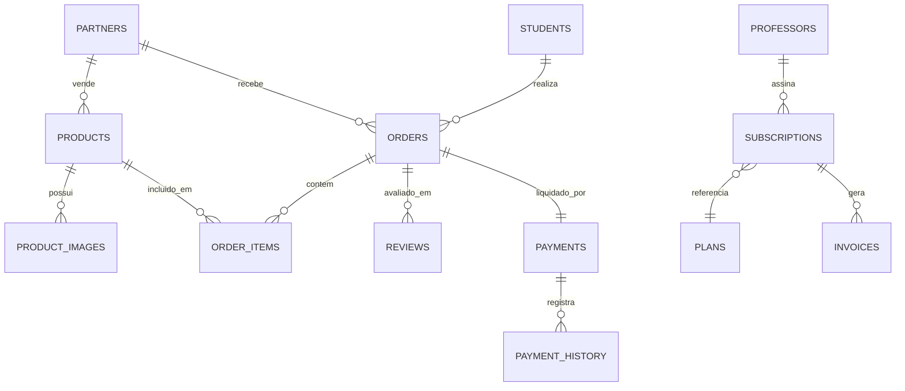

# MODELO DE DADOS — CLUBE DAS MUSAS

## 0. Papel deste documento

Este documento é o modelo lógico completo do banco de dados: entidades, relacionamentos, campos importantes, estratégia multi-tenant e a política de Row Level Security (RLS) de **cada** tabela.

Este não é o schema físico final (isso será formalizado em `packages/database/prisma/schema.prisma` durante a implementação — ver [01_ESTRUTURA_DO_PROJETO.md](01_ESTRUTURA_DO_PROJETO.md)), mas é a especificação autoritativa que o schema Prisma deve seguir. Nenhuma tabela pode ser criada na implementação sem estar mapeada aqui.

Todas as tabelas seguem, por padrão (exigência de [08_BANCO_DE_DADOS.md](08_BANCO_DE_DADOS.md)):

- `id` (UUID, chave primária)
- `created_at`, `updated_at`
- `deleted_at` (soft delete) quando a entidade representa dado de negócio relevante

Esses campos padrão **não são repetidos** nas tabelas de campos abaixo, para focar nos campos específicos de cada entidade.

---

## 1. Estratégia Multi-tenant

Conforme definido em [00_ARQUITETURA.md](00_ARQUITETURA.md#6-banco-de-dados), o isolamento é feito por **schema único + Row Level Security**, usando um discriminador de tenant por tabela. Existem três formas de discriminador, dependendo da posição da tabela na hierarquia de dados:

| Tipo de discriminador       | Como funciona                                                                        | Exemplo                                          |
| --------------------------- | ------------------------------------------------------------------------------------ | ------------------------------------------------ |
| **Direto**                  | A tabela possui a coluna `professor_id` diretamente                                  | `students`, `exercises`, `campaigns`             |
| **Indireto (via aluna)**    | A tabela referencia `student_id`, e o tenant é resolvido via `students.professor_id` | `student_progress`, `checkins`, `points_history` |
| **Indireto (via parceiro)** | A tabela referencia `partner_id`, tenant do parceiro (não do professor)              | `products`, `orders` (para a visão do parceiro)  |

**Motivo técnico:** nem toda tabela pertence a um professor diretamente — uma aluna pode, por exemplo, ter pedidos no Marketplace que pertencem ao domínio de um Parceiro, não de um Professor. Por isso o conceito de "tenant" não é um único campo universal, mas resolvido de acordo com o dono real daquele dado — daí a necessidade de políticas de RLS específicas por padrão de propriedade, descritas na seção 2.

---

## 2. Padrões de Row Level Security (RLS)

Para evitar repetir a mesma política 45 vezes, definimos **padrões reutilizáveis**. Cada tabela na seção 4 referencia um destes padrões pelo nome. As funções auxiliares (`current_user_id()`, `current_role()`, `current_professor_id()`) são funções SQL definidas uma única vez em `packages/database/src/rls`, que leem as variáveis de sessão definidas pelo NestJS via `SET LOCAL` a cada requisição (ver [00_ARQUITETURA.md](00_ARQUITETURA.md#62-dupla-camada-de-autorização-defense-in-depth)).

| Padrão                              | Regra                                                                                                                                                               | Quem acessa                                                                              |
| ----------------------------------- | ------------------------------------------------------------------------------------------------------------------------------------------------------------------- | ---------------------------------------------------------------------------------------- |
| **A — Tenant do Professor**         | `professor_id = current_professor_id()`                                                                                                                             | Professor: total nas próprias linhas. Admin: total (bypass documentado).                 |
| **B — Aluna via Professor**         | Para papel `aluna`: `student_id = current_user_id()`. Para papel `professor`: `student_id IN (SELECT id FROM students WHERE professor_id = current_professor_id())` | Aluna vê/edita apenas seus próprios registros; professor vê os de todas as suas alunas.  |
| **C — Estritamente próprio (self)** | `user_id = current_user_id()`                                                                                                                                       | Qualquer perfil, mas apenas a própria linha — nem professor nem admin têm acesso direto. |
| **D — Tenant do Parceiro**          | `partner_id = current_partner_id()`                                                                                                                                 | Parceiro: total nas próprias linhas. Admin: total.                                       |
| **E — Administrativo Global**       | Leitura pública controlada; escrita restrita a `current_role() = 'admin'`                                                                                           | Todos podem ler (ex.: planos disponíveis); só Admin escreve.                             |
| **F — Multi-parte (pedido)**        | Composição de B e D: aluna vê seus pedidos, parceiro vê pedidos dos próprios produtos, professor vê pedidos de suas alunas (leitura)                                | Aluna, Parceiro e Professor, cada um com sua fatia.                                      |
| **G — Auditoria (append-only)**     | `INSERT` livre pela aplicação (via função de auditoria); `SELECT` restrito a `current_role() = 'admin'` ou ao próprio dono do recurso auditado                      | Escrita automática pelo sistema; leitura restrita.                                       |

**Motivo técnico:** padronizar essas 7 políticas evita a inconsistência mais comum em projetos com RLS — cada desenvolvedor escrevendo uma política ligeiramente diferente para o mesmo tipo de relação de propriedade. Toda tabela nova deve se encaixar em um destes padrões; se não se encaixar, isso é um sinal de que o modelo de dados precisa ser revisado antes da tabela ser criada.

---

## 3. Diagramas de Entidade-Relacionamento por Domínio

### 3.1 Identidade, Professores e Planos

### 3.2 Alunas e Dados de Saúde

### 3.3 Exercícios e Treinos

### 3.4 Gamificação

### 3.5 Marketplace e Pagamentos

---

## 4. Entidades, Campos e Política de RLS

### 4.1 Autenticação e Identidade

#### `users`

| Campo          | Tipo                                          | Descrição                              |
| -------------- | --------------------------------------------- | -------------------------------------- |
| `auth_user_id` | uuid                                          | Referência ao usuário no Supabase Auth |
| `email`        | text                                          | Único                                  |
| `phone`        | text                                          | Opcional                               |
| `full_name`    | text                                          |                                        |
| `avatar_url`   | text                                          | Aponta para bucket `avatars`           |
| `role`         | enum(`admin`,`professor`,`student`,`partner`) | Perfil primário, imutável após criação |
| `status`       | enum(`active`,`suspended`)                    |                                        |

RLS: **Padrão C** para leitura/edição do próprio perfil; Admin com bypass para leitura/gestão.

#### `roles`, `permissions`, `user_roles`

Suporte a RBAC granular além do perfil primário (ex.: assistentes de professor com permissões restritas — plano Elite, seção 5 de [02_MODELO_DE_NEGOCIO.md](02_MODELO_DE_NEGOCIO.md)). Campos: `roles.name`, `permissions.resource` + `permissions.action`, `user_roles(user_id, role_id)`.

RLS: **Padrão E** (leitura pelo próprio tenant do professor a quem o assistente pertence; escrita restrita ao professor titular ou Admin).

#### `audit_logs`

| Campo                           | Tipo        | Descrição                                        |
| ------------------------------- | ----------- | ------------------------------------------------ |
| `user_id`                       | uuid        | Quem executou a ação                             |
| `action`                        | text        | Ex.: `login`, `student.delete`, `payment.update` |
| `resource_type` / `resource_id` | text / uuid | O que foi afetado                                |
| `ip_address`                    | inet        |                                                  |
| `metadata`                      | jsonb       | Contexto adicional                               |

RLS: **Padrão G**.

---

### 4.2 Professores e Planos

#### `professors`

| Campo              | Tipo                       | Descrição  |
| ------------------ | -------------------------- | ---------- |
| `user_id`          | uuid                       | FK `users` |
| `business_name`    | text                       |            |
| `theme_preference` | enum(`luxo`,`elegance`)    |            |
| `plan_id`          | uuid                       | FK `plans` |
| `status`           | enum(`active`,`suspended`) |            |

RLS: **Padrão A** (o próprio `professor_id` é o `id` desta tabela — caso especial do padrão A).

#### `plans`

Campos: `name`, `price`, `max_students`, `features` (jsonb), `billing_period`, `is_active`. RLS: **Padrão E**.

#### `licenses`

Campos: `professor_id`, `plan_id`, `status`, `started_at`, `expires_at`. RLS: **Padrão A**.

---

### 4.3 Alunas e Dados de Saúde

#### `students`

| Campo                                            | Tipo                                               | Descrição                                                                                                  |
| ------------------------------------------------ | -------------------------------------------------- | ---------------------------------------------------------------------------------------------------------- |
| `user_id`                                        | uuid                                               | Nullable até a aluna ativar a própria conta                                                                |
| `professor_id`                                   | uuid                                               | FK `professors`                                                                                            |
| `full_name`, `avatar_url`, `phone`, `birth_date` |                                                    |                                                                                                            |
| `email`                                          | text (nullable)                                    | Para onde o convite de ativação é enviado — `users.email` só existe após a ativação (adicionado na Fase 1) |
| `joined_at`                                      | date                                               | Data de entrada                                                                                            |
| `objective`                                      | text                                               |                                                                                                            |
| `status`                                         | enum(`active`,`inactive`,`suspended`,`delinquent`) |                                                                                                            |
| `invite_token`, `invite_expires_at`              | text (único, nullable), timestamp (nullable)       | Mecanismo de convite/ativação de conta (adicionado na Fase 1)                                              |

RLS: **Padrão A** para o professor; **Padrão B** (`student_id = id = current_user_id()`) para a própria aluna.

#### `student_notes`, `student_documents`

Anotações e documentos gerais. RLS: **Padrão B**.

#### `student_anamnesis` _(dado sensível)_

Campos: `health_conditions`, `restrictions`, `medications`, `answered_at`. RLS: **Padrão B**, com log de acesso obrigatório via `AuditModule` a cada leitura (não apenas escrita) — exceção às demais tabelas, que auditam apenas mutações.

#### `student_progress` _(dado sensível)_

Campos: `date`, `weight`, `body_fat_percentage` (informado pelo professor, nunca por IA), `photo_urls` (bucket `progress-photos`), `notes`, `created_by`. RLS: **Padrão B**.

#### `student_measurements` _(dado sensível)_

Campos: `date`, `chest`, `waist`, `hip`, `arm`, `thigh` (centímetros). RLS: **Padrão B**.

#### `student_blood_exams` _(dado sensível)_

Campos: `exam_date`, `file_url` (bucket `health-documents`), `notes`, `uploaded_by`. RLS: **Padrão B**, com URLs assinadas de curtíssima duração (ver [00_ARQUITETURA.md](00_ARQUITETURA.md#7-storage)).

---

### 4.4 Exercícios e Treinos

#### `exercises`

Campos: `professor_id`, `name`, `muscle_group`, `instructions`, `default_sets`, `default_reps`, `default_rest_seconds`. RLS: **Padrão A**.

#### `exercise_categories`, `exercise_videos`

`exercise_videos`: `exercise_id`, `url` (bucket `exercise-media`), `order`. RLS: **Padrão A** (resolvido via `exercise_id → exercises.professor_id`).

#### `workout_templates`, `workout_template_items`

`workout_template_items`: `template_id`, `exercise_id`, `order`, `sets`, `reps`, `load`, `rest_seconds`, `notes`. RLS: **Padrão A**.

#### `student_workouts`

Campos: `student_id`, `template_id` (nullable), `name`, `assigned_at`, `active`. Cópia independente do template no momento da atribuição (regra de negócio, [03_REGRAS_DE_NEGOCIO.md](03_REGRAS_DE_NEGOCIO.md#2-regras-de-treinos)). RLS: **Padrão B**.

#### `workout_history`

Campos: `student_workout_id`, `exercise_id`, `completed_at`, `photo_url` (bucket `checkin-photos`, obrigatório), `sets_completed`, `reps_completed`, `load_used`, `status` (`pending`,`completed`). RLS: **Padrão B**.

---

### 4.5 Check-ins

#### `checkins`

Campos: `student_id`, `date` (único por aluna/dia), `streak_count`. RLS: **Padrão B**.

#### `checkin_photos`

Campos: `checkin_id`, `photo_url`. RLS: **Padrão B** (via `checkin_id → checkins.student_id`).

---

### 4.6 Gamificação

#### `campaigns`

Campos: `professor_id`, `name`, `description`, `cover_image_url`, `start_date`, `end_date`, `status`, `ranking_visibility` (`public`,`private`). RLS: **Padrão A** para o professor; leitura liberada às alunas inscritas via **Padrão B** restrito a `SELECT`.

#### `campaign_rules`

Campos: `campaign_id`, `event_type`, `points`, `description`. RLS: **Padrão A** (via `campaign_id`).

#### `campaign_registrations`

Campos: `campaign_id`, `student_id`, `registered_at`. RLS: **Padrão B**.

#### `points_history`

Campos: `student_id`, `campaign_id` (nullable — nulo = pontos vitalícios), `event_type`, `points`, `reason`, `related_entity_type`, `related_entity_id`. Registro imutável (nunca `UPDATE`, apenas `INSERT`). RLS: **Padrão B** para leitura; escrita restrita a Services internos (não exposta a escrita direta por nenhum perfil).

#### `achievements`

Campos: `name`, `description`, `icon_url`, `criteria` (jsonb), `is_active`. Catálogo global da plataforma. RLS: **Padrão E**.

#### `student_achievements`

Campos: `student_id`, `achievement_id`, `unlocked_at`. Restrição de unicidade `(student_id, achievement_id)`. RLS: **Padrão B**.

#### `rewards`

Campos: `professor_id`, `name`, `description`, `cost_points` (nullable), `type` (`redemption`,`manual`,`campaign`,`birthday`), `stock`, `is_active`. RLS: **Padrão A**.

#### `reward_redemptions`

Campos: `reward_id`, `student_id`, `redeemed_at`, `status` (`pending`,`delivered`,`cancelled`), `points_spent`. RLS: **Padrão B**.

#### `rankings` _(projeção, não tabela de origem)_

Não existe como tabela transacional principal. É uma **projeção calculada** a partir de `points_history`, mantida em Redis (Sorted Set, ver [00_ARQUITETURA.md](00_ARQUITETURA.md#8-cache-redis)) para leitura em tempo real, com snapshots persistidos periodicamente em `campaign_ranking_snapshots` (histórico, para exibir "campeãs de edições anteriores" no feed). RLS de `campaign_ranking_snapshots`: **Padrão A**.

---

### 4.7 Feed

#### `posts`

Campos: `professor_id`, `author_id`, `type` (`announcement`,`challenge`,`photo`,`welcome`,`champion`,`system`), `content`, `published_at`. RLS: **Padrão A** para escrita (apenas professor/sistema); leitura via **Padrão B** para alunas do respectivo professor.

#### `post_images`

Campos: `post_id`, `url` (bucket `feed-media`), `order`. RLS: herda de `posts`.

#### `comments`, `reactions`

Campos `comments`: `post_id`, `student_id`, `content`. Campos `reactions`: `post_id`, `student_id`, `type`, único `(post_id, student_id)`. RLS: **Padrão B**. Aluna nunca publica `posts` diretamente (regra de negócio), mas pode reagir/comentar.

---

### 4.8 Marketplace

#### `partners`

Campos: `user_id`, `name`, `logo_url`, `description`, `category`, `region`, `contacts` (jsonb), `social_links` (jsonb), `status` (`pending`,`active`,`inactive`), `approved_by`, `approved_at`. RLS: **Padrão D**; leitura pública dos campos não sensíveis (nome, logo, categoria) para o catálogo do Marketplace via view controlada.

#### `partner_categories`, `products`, `product_images`

`products`: `partner_id`, `category_id`, `name`, `description`, `price`, `stock` (nullable p/ serviço), `type` (`product`,`service`), `status`. RLS: **Padrão D** para escrita; leitura pública para produtos com `status = active`.

#### `orders`

Campos: `student_id`, `partner_id`, `professor_id` (nullable, para split), `status`, `total_amount`, `payment_id`. RLS: **Padrão F**.

#### `order_items`

Campos: `order_id`, `product_id`, `quantity`, `unit_price`, `subtotal`. RLS: herda de `orders` (**Padrão F**).

#### `order_status_history`

Campos: `order_id`, `status`, `changed_at`, `changed_by`. RLS: **Padrão F**, somente leitura para aluna/parceiro; escrita restrita a Services internos.

#### `reviews`

Campos: `order_id`, `student_id`, `partner_id`, `rating`, `comment`, `partner_reply`, `partner_reply_at`. RLS: **Padrão F**; leitura pública (rating/comment) para o catálogo.

---

### 4.9 Pagamentos

#### `subscriptions`

Campos: `professor_id`, `plan_id`, `status` (`trialing`,`active`,`past_due`,`cancelled`), `current_period_start`, `current_period_end`, `cancel_at_period_end`. RLS: **Padrão A**.

#### `payments`

Campos: `type` (`subscription`,`student_fee`,`marketplace_order`), `reference_id`, `amount`, `method`, `status`, `mercado_pago_payment_id`, `split_details` (jsonb). RLS: composto — resolvido conforme `type` (Padrão A se `subscription`; Padrão F se `marketplace_order`).

#### `payment_history`

Campos: `payment_id`, `status`, `occurred_at`, `raw_webhook_payload` (jsonb, auditoria). RLS: **Padrão G**.

#### `invoices`

Campos: `subscription_id` ou `student_id`, `amount`, `due_date`, `status`, `paid_at`, `pdf_url`. RLS: **Padrão A** ou **B**, conforme origem.

#### `coupons`

Campos: `code`, `discount_type`, `discount_value`, `valid_from`, `valid_until`, `usage_limit`, `used_count`, `scope` (`subscription`,`marketplace`). RLS: **Padrão E**.

---

### 4.10 Notificações

#### `notifications`

Campos: `user_id`, `type`, `title`, `body`, `channel`, `read_at`, `metadata` (jsonb — nunca contendo dados de saúde, regra de negócio 12.2). RLS: **Padrão C**.

#### `notification_history`

Campos: `notification_id`, `channel`, `status` (`sent`,`failed`,`delivered`), `sent_at`, `error`. RLS: **Padrão G**.

---

### 4.11 Configurações

#### `settings`

Campos: `professor_id` (nullable = configuração global), `key`, `value` (jsonb). RLS: **Padrão A** (nullable → **Padrão E** quando global).

#### `theme_preferences`

Campos: `user_id`, `theme` (`luxo`,`elegance`). RLS: **Padrão C**.

---

### 4.12 Eventos de Domínio (Outbox)

Suporte estrutural ao padrão descrito em [05_ARQUITETURA_DE_EVENTOS.md](05_ARQUITETURA_DE_EVENTOS.md). São tabelas de plataforma, não de um módulo de negócio específico.

#### `domain_events`

| Campo          | Tipo                   | Descrição                                                 |
| -------------- | ---------------------- | --------------------------------------------------------- |
| `event_type`   | text                   | Ex.: `ExerciseCompleted`, `PointsAwarded`                 |
| `version`      | int                    | Versão do payload do evento                               |
| `payload`      | jsonb                  | Dados do evento                                           |
| `professor_id` | uuid                   | Discriminador de tenant, para escopar consultas/depuração |
| `published_at` | timestamptz (nullable) | Preenchido pelo Outbox Publisher após envio à fila        |

RLS: **Padrão G** (escrita apenas pela aplicação em transação; leitura restrita a Admin/observabilidade interna).

#### `processed_events`

| Campo           | Tipo        | Descrição                 |
| --------------- | ----------- | ------------------------- |
| `event_id`      | uuid        | FK `domain_events.id`     |
| `consumer_name` | text        | Ex.: `GamificationModule` |
| `processed_at`  | timestamptz |                           |

Restrição de unicidade `(event_id, consumer_name)` — é essa constraint que garante a idempotência descrita em [05_ARQUITETURA_DE_EVENTOS.md](05_ARQUITETURA_DE_EVENTOS.md#5-garantias-de-entrega-e-idempotência). RLS: **Padrão G**.

---

## 5. Índices Recomendados

| Tabela            | Índice                                                  | Motivo                                                       |
| ----------------- | ------------------------------------------------------- | ------------------------------------------------------------ |
| `students`        | `(professor_id, status)`                                | Filtro mais comum do dashboard do professor                  |
| `points_history`  | `(student_id, created_at)`                              | Cálculo de ranking e histórico                               |
| `checkins`        | `(student_id, date)` único                              | Garante regra de 1 check-in/dia e acelera consulta de streak |
| `workout_history` | `(student_workout_id, completed_at)`                    | Linha do tempo de treinos                                    |
| `orders`          | `(partner_id, status)`, `(student_id, status)`          | Painéis de pedidos de ambos os lados                         |
| `notifications`   | `(user_id, read_at)`                                    | Contagem de não lidas                                        |
| `audit_logs`      | `(user_id, created_at)`, `(resource_type, resource_id)` | Consultas de auditoria por usuário ou por recurso            |

**Motivo técnico:** todos os índices compostos colocam a coluna de tenant/propriedade (`professor_id`, `student_id`, `partner_id`, `user_id`) como primeiro campo — alinhado ao padrão de acesso definido pela RLS, onde toda consulta já filtra por esse campo primeiro.

---

## 6. Considerações de Performance e Escala

1. Tabelas de alto volume de escrita e leitura por agregação (`points_history`, `workout_history`, `checkins`) devem ser particionadas por data (partitioning nativo do Postgres) quando o volume ultrapassar a casa de dezenas de milhões de linhas — não é necessário na Fase 0, mas o modelo já é compatível com particionamento futuro por usar `created_at`/`date` de forma consistente.
2. Rankings e dashboards agregados nunca devem ser calculados via `COUNT`/`SUM` direto em tabelas grandes a cada requisição — usam cache (Redis) e/ou projeções pré-calculadas por job assíncrono (ver [05_ARQUITETURA_DE_EVENTOS.md](05_ARQUITETURA_DE_EVENTOS.md)).
3. Toda tabela de log/auditoria (`audit_logs`, `payment_history`, `notification_history`) é **append-only** — nunca recebe `UPDATE`, apenas `INSERT`, o que simplifica replicação e backup incremental.

---

## 7. Resumo de RLS — Checklist de Cobertura

| Módulo             | Tabelas                                                                                                                                                                          | Padrão(ões) aplicado(s) |
| ------------------ | -------------------------------------------------------------------------------------------------------------------------------------------------------------------------------- | ----------------------- |
| Identidade         | `users`, `roles`, `permissions`, `user_roles`, `audit_logs`                                                                                                                      | C, E, G                 |
| Professores        | `professors`, `plans`, `licenses`                                                                                                                                                | A, E                    |
| Alunas             | `students`, `student_notes`, `student_documents`, `student_anamnesis`, `student_progress`, `student_measurements`, `student_blood_exams`                                         | A, B                    |
| Exercícios/Treinos | `exercises`, `exercise_categories`, `exercise_videos`, `workout_templates`, `workout_template_items`, `student_workouts`, `workout_history`                                      | A, B                    |
| Check-ins          | `checkins`, `checkin_photos`                                                                                                                                                     | B                       |
| Gamificação        | `campaigns`, `campaign_rules`, `campaign_registrations`, `points_history`, `achievements`, `student_achievements`, `rewards`, `reward_redemptions`, `campaign_ranking_snapshots` | A, B, E                 |
| Feed               | `posts`, `post_images`, `comments`, `reactions`                                                                                                                                  | A, B                    |
| Marketplace        | `partners`, `partner_categories`, `products`, `product_images`, `orders`, `order_items`, `order_status_history`, `reviews`                                                       | D, F                    |
| Pagamentos         | `subscriptions`, `payments`, `payment_history`, `invoices`, `coupons`                                                                                                            | A, B, F, E, G           |
| Notificações       | `notifications`, `notification_history`                                                                                                                                          | C, G                    |
| Configurações      | `settings`, `theme_preferences`                                                                                                                                                  | A, E, C                 |
| Eventos de Domínio | `domain_events`, `processed_events`                                                                                                                                              | G                       |

**Regra de implementação:** nenhuma tabela pode ser criada via migration sem que sua linha correspondente exista nesta checklist, e nenhuma migration é aprovada em code review sem a política RLS já anexada na mesma migration (nunca "RLS depois").

---

Este modelo de dados é a fonte de verdade para o schema Prisma. Qualquer divergência entre a implementação e este documento deve ser resolvida atualizando este documento primeiro, depois o código.
