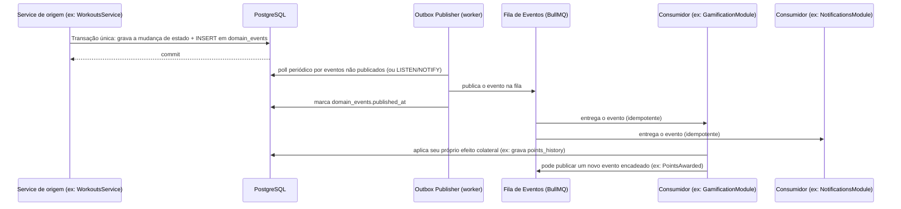

# ARQUITETURA DE EVENTOS (EVENT-DRIVEN) — CLUBE DAS MUSAS

## 0. Papel deste documento

Este documento define como o sistema reage a **fatos de negócio** (algo que aconteceu) de forma desacoplada entre módulos. Ele complementa a seção 9 ("Filas") de [00_ARQUITETURA.md](00_ARQUITETURA.md), detalhando especificamente o padrão de **eventos de domínio**, que é uma camada conceitual acima de "processar um job em background".

Este documento não contém código — define o padrão, o catálogo de eventos e as garantias que a implementação deve seguir.

---

## 1. Por que Event-Driven, além de filas de job

A seção 9 de [00_ARQUITETURA.md](00_ARQUITETURA.md) já define BullMQ para tarefas assíncronas (ex.: "recalcular ranking", "enviar e-mail"). Isso resolve **onde processar** algo pesado fora do ciclo HTTP. Mas não resolve um problema diferente e mais importante para a organização do código: **quem decide que aquele processamento deve acontecer**.

Sem um padrão de eventos, a tentação natural é que, por exemplo, o `WorkoutsService` (ao concluir um exercício) chame diretamente `GamificationService.addPoints()`, `NotificationsService.notify()` e `FeedService.publishAutoPost()`. Isso cria **acoplamento direto entre módulos de domínio** — exatamente o problema que a arquitetura modular (seção 5.1 de [00_ARQUITETURA.md](00_ARQUITETURA.md)) foi desenhada para evitar.

**Motivo técnico:** a solução é inverter a dependência. O `WorkoutsModule` não conhece o `GamificationModule` nem o `NotificationsModule` — ele apenas **anuncia um fato** ("um exercício foi concluído") e não sabe (nem precisa saber) quem reage a isso. Cada módulo interessado se inscreve nesse fato de forma independente. Isso mantém os módulos de domínio verdadeiramente isolados dentro do monólito, e é exatamente o desenho que permite, no futuro, extrair um módulo para um serviço separado sem reescrever a lógica de comunicação — apenas trocar o transporte do evento.

---

## 2. Padrão Adotado

Dois mecanismos complementares, escolhidos conforme a criticidade do efeito colateral:

| Mecanismo                                                 | Quando usar                                                                                                                                 | Garantia                                                                                                                                                                   |
| --------------------------------------------------------- | ------------------------------------------------------------------------------------------------------------------------------------------- | -------------------------------------------------------------------------------------------------------------------------------------------------------------------------- |
| **Event Emitter interno** (in-process, síncrono/imediato) | Reações rápidas, não críticas, que não envolvem I/O externo nem podem falhar de forma relevante (ex.: invalidar uma entrada de cache local) | Sem persistência — se o processo cair entre o evento e a reação, a reação é perdida. Aceitável apenas para efeitos não críticos.                                           |
| **Transactional Outbox + Fila (BullMQ)**                  | Qualquer efeito colateral que precise ocorrer com garantia (pontos, notificações, atualização de ranking, IA, integrações externas)         | At-least-once — o evento é persistido no banco na mesma transação da mudança de estado, garantindo que nunca seja perdido mesmo se a fila estiver indisponível no momento. |

**Motivo técnico:** a maioria dos efeitos colaterais deste sistema (conceder pontos, notificar, desbloquear conquista) **não pode ser perdida** — perder um evento de pontuação, por exemplo, é uma falha de produto visível e frustrante para a aluna. Por isso o padrão _Transactional Outbox_ é o padrão principal; o Event Emitter interno é reservado a casos onde perder o evento ocasionalmente é aceitável.

### 2.1 Como o Transactional Outbox funciona aqui

1. A tabela `domain_events` (append-only) grava **o fato**, dentro da mesma transação do banco que originou o evento — se a transação falhar, o evento nunca existiu; se a transação for confirmada, o evento é garantido.
2. Um processo publicador (parte dos `workers/` definidos em [01_ESTRUTURA_DO_PROJETO.md](01_ESTRUTURA_DO_PROJETO.md)) lê eventos não publicados e os envia para a fila BullMQ.
3. Cada módulo interessado consome o evento de forma independente e idempotente (seção 5).

**Motivo técnico:** sem o Outbox, existe uma janela clássica de falha — "salvei a mudança no banco, mas o processo caiu antes de enfileirar o job" — resultando em uma aluna que concluiu um exercício mas nunca recebeu os pontos. O Outbox elimina essa janela porque o evento é gravado atomicamente junto com o fato que o originou.

---

## 3. Catálogo de Eventos de Domínio

| Evento                   | Módulo produtor                                      | Payload principal                                              | Consumidores                                                                                          | Encadeia?                                       |
| ------------------------ | ---------------------------------------------------- | -------------------------------------------------------------- | ----------------------------------------------------------------------------------------------------- | ----------------------------------------------- |
| `StudentRegistered`      | StudentsModule                                       | `student_id`, `professor_id`                                   | NotificationsModule, GamificationModule (conquista "Bem-vinda")                                       | Sim → `AchievementUnlocked`                     |
| `ExerciseCompleted`      | WorkoutsModule                                       | `student_id`, `exercise_id`, `student_workout_id`, `photo_url` | CheckinsModule, GamificationModule, FeedModule                                                        | Sim → `CheckinRegistered`, `PointsAwarded`      |
| `CheckinRegistered`      | CheckinsModule                                       | `student_id`, `date`, `streak_count`                           | GamificationModule, NotificationsModule                                                               | Sim → `PointsAwarded`                           |
| `PointsAwarded`          | GamificationModule                                   | `student_id`, `points`, `reason`, `source_event`               | Projeção de Ranking (Redis), NotificationsModule, GamificationModule (verificação de nível/conquista) | Sim → `StudentLeveledUp`, `AchievementUnlocked` |
| `StudentLeveledUp`       | GamificationModule                                   | `student_id`, `new_level`                                      | NotificationsModule, FeedModule                                                                       | Não                                             |
| `AchievementUnlocked`    | GamificationModule                                   | `student_id`, `achievement_id`                                 | NotificationsModule, FeedModule                                                                       | Não                                             |
| `CampaignRankingChanged` | Worker de recálculo (batch)                          | `campaign_id`, `top_students`                                  | Cache de Ranking (Redis), FeedModule (ex.: "campeã da semana")                                        | Não                                             |
| `RewardRedeemed`         | GamificationModule                                   | `student_id`, `reward_id`, `points_spent`                      | NotificationsModule, ProfessorsModule (fila de aprovação, se manual)                                  | Não                                             |
| `OrderPaid`              | PaymentsModule (via webhook Mercado Pago confirmado) | `order_id`, `amount`, `split_details`                          | MarketplaceModule, NotificationsModule, GamificationModule (pontos por compra, se configurado)        | Sim → `PointsAwarded` (opcional)                |
| `OrderStatusChanged`     | MarketplaceModule                                    | `order_id`, `old_status`, `new_status`                         | NotificationsModule                                                                                   | Não                                             |
| `PaymentFailed`          | PaymentsModule                                       | `payment_id`, `reason`                                         | NotificationsModule, ProfessorsModule (indicador de inadimplência)                                    | Não                                             |
| `SubscriptionCancelled`  | PaymentsModule                                       | `professor_id`, `effective_date`                               | AdminModule, NotificationsModule                                                                      | Não                                             |
| `PartnerApproved`        | AdminModule                                          | `partner_id`                                                   | NotificationsModule, MarketplaceModule (libera catálogo)                                              | Não                                             |

**Motivo técnico:** eventos são sempre nomeados **no passado** (`Completed`, `Unlocked`, `Changed`) — nunca como comando (`CompleteExercise`, `AwardPoints`). Isso reforça, mesmo na nomenclatura, que um evento é um fato imutável que já aconteceu, e não uma instrução que o consumidor é obrigado a executar de uma forma específica — cada consumidor decide livremente como reagir ao fato.

### 3.1 Exemplo de encadeamento completo

Um único `ExerciseCompleted` pode, de forma assíncrona e desacoplada, disparar uma cadeia: `ExerciseCompleted → CheckinRegistered → PointsAwarded → StudentLeveledUp → AchievementUnlocked → notificações e post automático no feed` — sem que o `WorkoutsModule` original tenha qualquer conhecimento dessa cadeia.

---

## 4. Versionamento de Eventos

Cada payload de evento é um tipo definido em `packages/types/src/events`, com um campo `version` (ex.: `1`). Mudanças incompatíveis no payload criam um novo tipo (`ExerciseCompletedV2`) em vez de alterar o existente.

**Motivo técnico:** como múltiplos módulos consomem o mesmo evento de forma independente, alterar silenciosamente o formato de um payload existente quebraria consumidores que não foram atualizados simultaneamente — o mesmo raciocínio já aplicado ao versionamento da API REST (`/api/v1/`) em [00_ARQUITETURA.md](00_ARQUITETURA.md#54-versionamento-e-documentação) se aplica aqui.

---

## 5. Garantias de Entrega e Idempotência

1. A fila garante **at-least-once delivery** (um evento pode, em cenários raros de falha/retry, ser entregue mais de uma vez).
2. Por isso, **todo consumidor deve ser idempotente**: processar o mesmo evento duas vezes não pode gerar efeito duplicado (ex.: pontos concedidos em dobro).
3. A idempotência é garantida por uma chave de deduplicação por consumidor (ex.: `event_id + consumer_name` registrado em uma tabela `processed_events`) — se a chave já existe, o consumidor descarta o evento silenciosamente.

**Motivo técnico:** garantir "exactly-once" de verdade em sistemas distribuídos é notoriamente complexo e caro; a prática consolidada da indústria é aceitar "at-least-once" na entrega e mover a responsabilidade de idempotência para o consumidor, que já precisa conhecer sua própria regra de negócio para deduplicar corretamente (ex.: "só posso desbloquear esta conquista uma vez por aluna", regra que já existe independentemente da fila, conforme [03_REGRAS_DE_NEGOCIO.md](03_REGRAS_DE_NEGOCIO.md#6-conquistas-achievements)).

---

## 6. Preparação para Escala Futura

O desenho atual (Postgres Outbox + BullMQ/Redis) é suficiente para a escala descrita em [00_ARQUITETURA.md](00_ARQUITETURA.md) (milhares de professores, centenas de milhares de alunas). Caso o volume de eventos cresça a ponto de justificar um message broker dedicado (ex.: Kafka, AWS SNS/SQS) ou a extração de um módulo para um serviço independente (ex.: Gamificação como serviço isolado, se precisar escalar 100x mais que o restante):

- **Nenhuma mudança de lógica de negócio é necessária** — produtores continuam publicando o mesmo evento nomeado e versionado; consumidores continuam reagindo da mesma forma.
- Apenas o **transporte** muda (troca-se BullMQ por outro broker), porque o desenho já trata cada evento como uma mensagem nomeada, versionada e idempotente desde o início.

**Motivo técnico:** esta é a justificativa central para investir em uma arquitetura de eventos formal mesmo dentro de um monólito modular — o custo de design é pago uma vez, agora, e o sistema fica genuinamente preparado para evoluir para múltiplos serviços no futuro sem reescrever a comunicação entre domínios, apenas o transporte.

---

## 7. Resumo ADR

| Decisão                                                                                         | Alternativas consideradas                                                   | Motivo da escolha                                                                                                                                                              |
| ----------------------------------------------------------------------------------------------- | --------------------------------------------------------------------------- | ------------------------------------------------------------------------------------------------------------------------------------------------------------------------------ |
| Eventos de domínio via Transactional Outbox + BullMQ, em vez de chamadas diretas entre Services | Chamada direta entre módulos; message broker externo (Kafka) desde o início | Desacopla módulos sem custo de infraestrutura externa prematura; preserva garantia de entrega via Outbox; mantém caminho de evolução para broker externo sem reescrever lógica |
| Consumidores idempotentes com deduplicação própria                                              | Garantir exactly-once na infraestrutura de mensageria                       | Exactly-once é caro e complexo; idempotência no consumidor é o padrão consolidado da indústria e já é exigida pelas próprias regras de negócio (ex.: conquista única)          |
| Eventos nomeados no passado e versionados em `packages/types`                                   | Payloads ad-hoc por chamada de fila                                         | Clareza semântica (fato, não comando) e evolução segura do contrato entre produtores e consumidores                                                                            |

---

Este documento deve ser consultado sempre que um novo fluxo de negócio precisar reagir a algo que acontece em outro módulo — a resposta correta é quase sempre "publicar/consumir um evento", nunca uma chamada direta entre Services de módulos diferentes.
