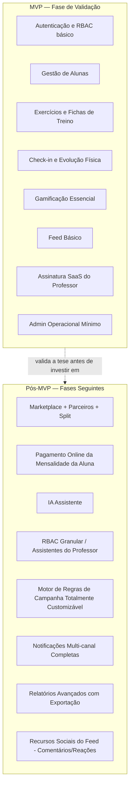

# DEFINIÇÃO OFICIAL DO MVP — CLUBE DAS MUSAS

## 0. Papel deste documento

Este documento define o **Produto Mínimo Viável (MVP)** do Clube das Musas: o menor conjunto de funcionalidades que já entrega a proposta de valor central definida em [02_MODELO_DE_NEGOCIO.md](02_MODELO_DE_NEGOCIO.md) e permite cobrar assinatura de professores reais.

Nenhuma funcionalidade listada como obrigatória aqui pode ser cortada durante a implementação sem nova aprovação. Nenhuma funcionalidade listada como "futura" deve ser implementada antes do MVP estar completo e validado — evita o risco mais comum de projetos ambiciosos: nunca lançar por tentar entregar tudo de uma vez.

---

## 1. Critério de Corte

Uma funcionalidade entra no MVP **somente se** responder "sim" a ambas as perguntas:

1. Sua ausência impede a validação da proposta de valor central ("reduzir o churn de alunas através de gestão profissional + gamificação")?
2. Sua ausência impede a plataforma de gerar receita (assinatura do professor)?

Funcionalidades que aumentam a receita de forma **secundária** (Marketplace, take rate) ou aumentam engajamento de forma **incremental** (IA Assistente, notificações multi-canal completas) não passam no critério e ficam para depois — mesmo sendo importantes para o modelo de negócio de longo prazo.

**Motivo técnico/estratégico:** o risco central de um MVP não é "fazer pouco", é "fazer o suficiente para provar a tese errada" — se o Marketplace fosse incluído no MVP e falhasse, não saberíamos se o problema foi o Marketplace ou a tese de retenção central. Isolar o núcleo permite validar (ou invalidar) a tese principal rapidamente.

---

## 2. Escopo do MVP por Módulo

---

## 3. Funcionalidades Obrigatórias — Aluna

| #   | Funcionalidade         | Detalhe do escopo no MVP                                                                                         |
| --- | ---------------------- | ---------------------------------------------------------------------------------------------------------------- |
| 1   | Ativação de conta      | Via convite do professor (link/e-mail), login seguro via Supabase Auth                                           |
| 2   | Tela inicial           | Próximo treino, streak atual, pontuação total, avisos do professor                                               |
| 3   | Ficha de treino do dia | Visualização organizada por dia, com vídeo/instruções de cada exercício                                          |
| 4   | Conclusão de exercício | Sempre com envio obrigatório de foto, validado no backend                                                        |
| 5   | Check-in automático    | Registrado ao concluir ao menos um exercício válido no dia                                                       |
| 6   | Minha Evolução         | Fotos, peso, medidas e percentual de gordura (informado pelo professor), com comparação simples entre duas datas |
| 7   | Gamificação essencial  | Pontuação total, histórico de pontos, ranking de uma campanha ativa, medalhas/conquistas desbloqueadas           |
| 8   | Feed (leitura)         | Visualização de avisos e publicações do professor                                                                |
| 9   | Situação de pagamento  | Visualização do status da mensalidade (em dia/pendente/vencida) — sem cobrança online no MVP                     |
| 10  | Perfil                 | Dados básicos, medalhas, troca entre os temas Luxo/Elegance                                                      |

## 4. Funcionalidades Obrigatórias — Professor

| #   | Funcionalidade           | Detalhe do escopo no MVP                                                                                                                                                                                          |
| --- | ------------------------ | ----------------------------------------------------------------------------------------------------------------------------------------------------------------------------------------------------------------- |
| 1   | Onboarding e assinatura  | Cadastro, escolha de plano, trial de 14 dias, assinatura recorrente via Mercado Pago (sem split — cobrança simples professor→plataforma)                                                                          |
| 2   | Dashboard                | Total de alunas, ativas, inadimplentes, aniversários próximos, últimos check-ins, alunas há mais de 7 dias sem treinar                                                                                            |
| 3   | Cadastro de alunas       | CRUD completo, convite de acesso, histórico e linha do tempo                                                                                                                                                      |
| 4   | Biblioteca de exercícios | CRUD de exercícios próprios (nome, grupo muscular, vídeo, instruções)                                                                                                                                             |
| 5   | Fichas de treino         | Criação de modelos reutilizáveis e atribuição individual personalizável                                                                                                                                           |
| 6   | Evolução física da aluna | Registro de peso, medidas, percentual de gordura e fotos                                                                                                                                                          |
| 7   | Anamnese                 | Registro básico de condições de saúde e restrições                                                                                                                                                                |
| 8   | Check-ins                | Visualização do histórico de check-ins de cada aluna                                                                                                                                                              |
| 9   | Gamificação essencial    | Criação de **uma campanha por vez**, com regras de pontuação a partir de templates pré-definidos (não um construtor de regras totalmente livre), ranking público ou privado, concessão manual de pontos e prêmios |
| 10  | Feed (escrita)           | Publicação de avisos, boas-vindas, desafios                                                                                                                                                                       |
| 11  | Pagamentos da aluna      | Registro manual do status de pagamento da mensalidade (marcar como pago/pendente)                                                                                                                                 |
| 12  | Relatórios básicos       | Visualização em tela dos indicadores do dashboard, sem exportação avançada                                                                                                                                        |
| 13  | Configurações            | Escolha de tema padrão (Luxo/Elegance) da própria operação                                                                                                                                                        |

## 5. Escopo Mínimo do Admin (necessário para o MVP operar)

O Admin não foi listado explicitamente no pedido, mas sem um mínimo operacional o MVP não consegue nem colocar um professor pagante em produção. Escopo mínimo:

- Login com MFA obrigatório.
- Criar/bloquear contas de professor.
- Visualizar planos e status de assinatura.
- Visualizar logs de auditoria básicos.

Aprovação de parceiros e dashboards financeiros agregados completos ficam para quando o Marketplace for implementado.

---

## 6. Funcionalidades que Ficam para Versões Futuras

| Funcionalidade                                                                    | Por que fica de fora do MVP                                                                                                                               |
| --------------------------------------------------------------------------------- | --------------------------------------------------------------------------------------------------------------------------------------------------------- |
| **Marketplace completo** (parceiros, produtos, carrinho, pedidos, avaliações)     | Fonte de receita secundária; exige onboarding de parceiros externos, que não é necessário para validar a tese de retenção                                 |
| **Split de pagamento**                                                            | Depende do Marketplace existir                                                                                                                            |
| **Pagamento online da mensalidade da aluna** (PIX/cartão via Mercado Pago)        | No MVP, o registro é manual pelo professor; automatizar a cobrança é uma melhoria de eficiência, não uma validação da tese central                        |
| **IA Assistente**                                                                 | Recurso de engajamento incremental; o núcleo de gamificação já testa a motivação da aluna sem IA                                                          |
| **RBAC granular / assistentes do professor**                                      | Recurso do plano Elite, relevante apenas quando houver operações maduras usando a plataforma                                                              |
| **Motor de regras de campanha totalmente customizável na UI**                     | O MVP usa templates de regras pré-definidos; o modelo de dados já é configurável (nunca hardcoded), a limitação é apenas na interface, não na arquitetura |
| **Múltiplas campanhas simultâneas**                                               | Uma campanha ativa por vez é suficiente para validar o loop de motivação                                                                                  |
| **Comentários e reações no feed**                                                 | Recurso social incremental, sem impacto na tese de retenção central                                                                                       |
| **Notificações multi-canal completas com central de preferências**                | MVP usa notificação in-app + um canal externo (e-mail ou push) para eventos críticos; central de preferências granular é refinamento                      |
| **Relatórios avançados com exportação (PDF/CSV, filtros)**                        | Visualização em tela já é suficiente para o professor tomar decisões no MVP                                                                               |
| **Programa de indicação, chat direto professor-aluna, integrações de calendário** | Funcionalidades sugeridas de expansão (ver análise inicial do projeto), não fazem parte do escopo original nem do MVP                                     |

**Motivo técnico:** nenhuma dessas funcionalidades é removida do produto — todas permanecem no roadmap e já têm lugar reservado na arquitetura (ex.: `packages/database` já modela `partners`, `products`, RBAC granular via `roles`/`permissions`, conforme [04_MODELO_DE_DADOS.md](04_MODELO_DE_DADOS.md)). O corte é de **sequenciamento**, não de escopo final do produto.

---

## 7. Definição de "Pronto" do MVP

O MVP está pronto para lançamento comercial quando:

1. Um professor consegue se cadastrar, assinar um plano, cadastrar alunas, criar fichas e uma campanha, sem qualquer suporte manual da equipe.
2. Uma aluna consegue ativar a conta, treinar, concluir exercícios com foto, ver sua evolução e participar da gamificação, sem qualquer explicação verbal (teste dos 30 segundos, [PROMPT_MESTRE.md](PROMPT_MESTRE.md)).
3. Todas as regras de segurança e RLS descritas em [04_MODELO_DE_DADOS.md](04_MODELO_DE_DADOS.md) estão implementadas e testadas para os módulos do MVP.
4. O professor recebe cobrança recorrente automática via Mercado Pago sem intervenção manual.

---

Este documento é a referência de escopo para todas as fases de implementação. Qualquer solicitação de incluir uma funcionalidade "futura" antes do MVP estar completo deve ser explicitamente reaprovada, alterando este documento primeiro.
