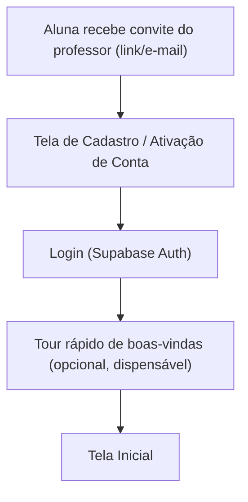
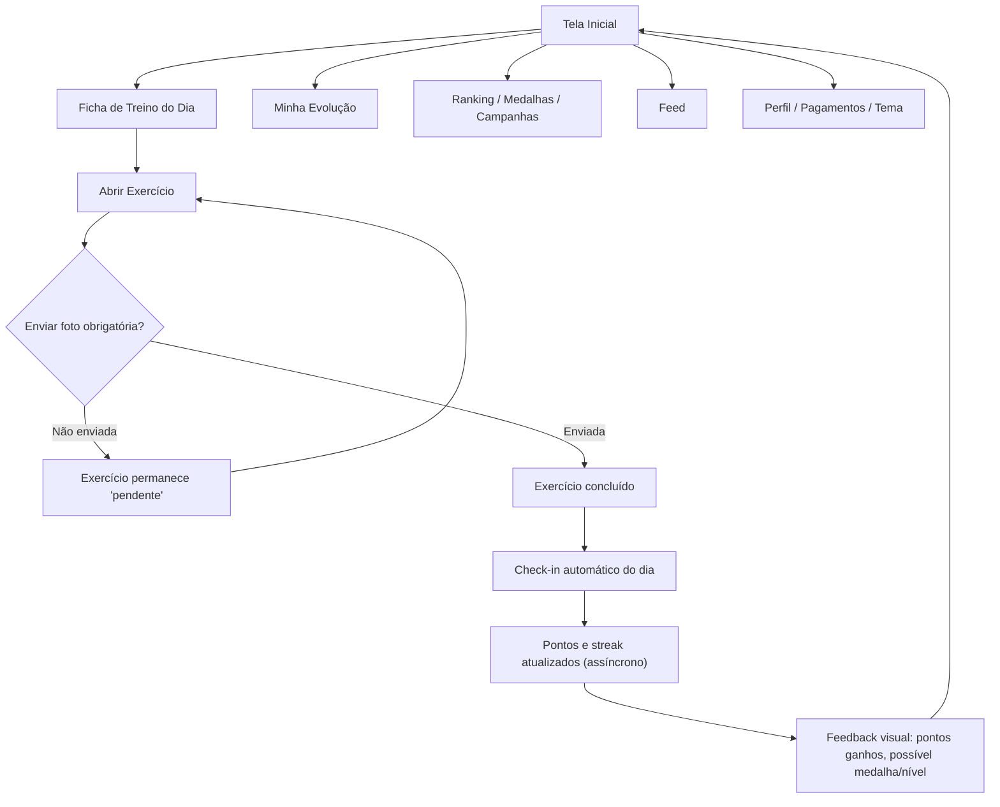
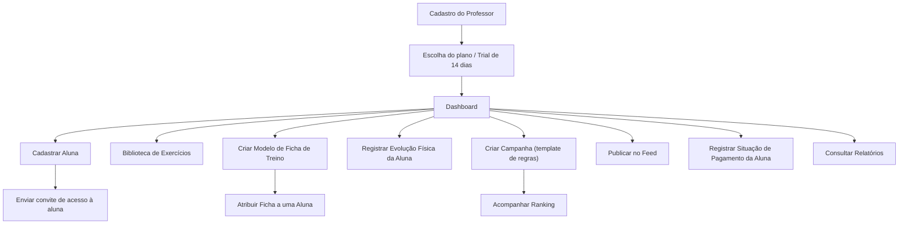
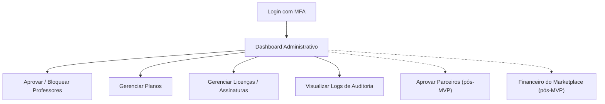
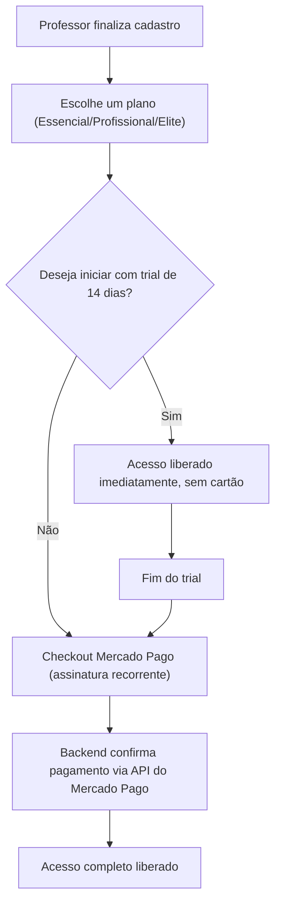

# MAPA DE TELAS E FLUXOS — CLUBE DAS MUSAS

## 0. Papel deste documento

Este documento mapeia todas as telas da plataforma, organizadas pela mesma estrutura de rotas definida em [01_ESTRUTURA_DO_PROJETO.md](01_ESTRUTURA_DO_PROJETO.md), e os fluxos de navegação principais de cada perfil. Cada tela é marcada como **MVP** ou **Futuro**, de acordo com [06_MVP.md](06_MVP.md).

O objetivo é validar a experiência completa antes de qualquer linha de código ser escrita.

---

## 1. Inventário de Telas

> **Nota de implementação:** as rotas abaixo usam prefixo real por perfil (`/professor/...`, `/aluna/...`, `/parceiro/...`), não route groups — necessário para evitar colisão de URLs entre telas com o mesmo nome em perfis diferentes (ex.: "feed") e para permitir que o `proxy.ts` (antigo `middleware.ts`) valide o perfil pelo prefixo da rota. Ver [01_ESTRUTURA_DO_PROJETO.md](01_ESTRUTURA_DO_PROJETO.md#2-appsweb--professor-aluna-e-parceiro).

### 1.1 `apps/web` — Área Pública

| Tela                                       | Rota               | Escopo |
| ------------------------------------------ | ------------------ | ------ |
| Landing / Apresentação                     | `/`                | MVP    |
| Login                                      | `/login`           | MVP    |
| Cadastro / Ativação de conta (via convite) | `/cadastro`        | MVP    |
| Recuperação de senha                       | `/recuperar-senha` | MVP    |

### 1.2 `apps/web` — Área do Professor

| Tela                              | Rota                                       | Escopo                                                      |
| --------------------------------- | ------------------------------------------ | ----------------------------------------------------------- |
| Dashboard                         | `/professor/dashboard`                     | MVP                                                         |
| Lista de Alunas                   | `/professor/alunas`                        | MVP                                                         |
| Perfil da Aluna — Visão geral     | `/professor/alunas/[studentId]`            | MVP                                                         |
| Perfil da Aluna — Evolução        | `/professor/alunas/[studentId]/evolucao`   | MVP                                                         |
| Perfil da Aluna — Anamnese        | `/professor/alunas/[studentId]/anamnese`   | MVP                                                         |
| Perfil da Aluna — Pagamentos      | `/professor/alunas/[studentId]/pagamentos` | MVP (registro manual)                                       |
| Perfil da Aluna — Ficha de Treino | `/professor/alunas/[studentId]/ficha`      | MVP                                                         |
| Biblioteca de Exercícios          | `/professor/exercicios`                    | MVP                                                         |
| Fichas de Treino (Modelos)        | `/professor/fichas-de-treino`              | MVP                                                         |
| Campanhas                         | `/professor/campanhas`                     | MVP (uma ativa por vez)                                     |
| Feed (publicação)                 | `/professor/feed`                          | MVP                                                         |
| Relatórios                        | `/professor/relatorios`                    | MVP (básico, sem exportação) — exportação avançada é Futuro |
| Configurações                     | `/professor/configuracoes`                 | MVP                                                         |
| Assinatura / Plano                | `/professor/configuracoes/assinatura`      | MVP                                                         |
| Assistentes (RBAC granular)       | `/professor/configuracoes/assistentes`     | Futuro                                                      |

### 1.3 `apps/web` — Área da Aluna

| Tela                                       | Rota                          | Escopo                                                  |
| ------------------------------------------ | ----------------------------- | ------------------------------------------------------- |
| Início                                     | `/aluna/inicio`               | MVP                                                     |
| Ficha de Treino                            | `/aluna/treino`               | MVP                                                     |
| Execução de Exercício (com upload de foto) | `/aluna/treino/[exerciseId]`  | MVP                                                     |
| Histórico de Check-in                      | `/aluna/checkin`              | MVP                                                     |
| Minha Evolução                             | `/aluna/evolucao`             | MVP                                                     |
| Comparar Evolução                          | `/aluna/evolucao/comparar`    | MVP                                                     |
| Gamificação — Ranking/Medalhas/Campanhas   | `/aluna/gamificacao`          | MVP                                                     |
| Feed (leitura)                             | `/aluna/feed`                 | MVP                                                     |
| Marketplace                                | `/aluna/marketplace`          | Futuro                                                  |
| Carrinho                                   | `/aluna/marketplace/carrinho` | Futuro                                                  |
| Pagamentos                                 | `/aluna/pagamentos`           | MVP (visualização de status) — checkout online é Futuro |
| Perfil                                     | `/aluna/perfil`               | MVP                                                     |

### 1.4 `apps/web` — Área do Parceiro

| Tela                  | Rota                   | Escopo |
| --------------------- | ---------------------- | ------ |
| Dashboard do Parceiro | `/parceiro/dashboard`  | Futuro |
| Produtos              | `/parceiro/produtos`   | Futuro |
| Pedidos               | `/parceiro/pedidos`    | Futuro |
| Avaliações            | `/parceiro/avaliacoes` | Futuro |
| Repasses              | `/parceiro/repasses`   | Futuro |

### 1.5 `apps/admin`

| Tela                     | Rota                        | Escopo                                  |
| ------------------------ | --------------------------- | --------------------------------------- |
| Login com MFA            | `(auth)/login`              | MVP                                     |
| Dashboard                | `dashboard`                 | MVP (indicadores essenciais)            |
| Professores              | `professores`               | MVP                                     |
| Perfil do Professor      | `professores/[professorId]` | MVP                                     |
| Planos                   | `planos`                    | MVP                                     |
| Licenças                 | `licencas`                  | MVP                                     |
| Parceiros pendentes      | `parceiros-pendentes`       | Futuro                                  |
| Pagamentos da plataforma | `pagamentos`                | MVP (assinatura) / Futuro (marketplace) |
| Logs de auditoria        | `logs`                      | MVP                                     |

---

## 2. Fluxo da Aluna

### 2.1 Onboarding

**Nota de UX:** o cadastro nunca começa "do zero" — a aluna já existe como registro criado pelo professor (`students`); o convite apenas vincula uma conta de autenticação (`users`) a esse registro existente. Isso evita pedir novamente dados que o professor já cadastrou.

### 2.2 Loop Diário de Uso (fluxo central da experiência)

**Motivo de UX:** o retorno para a Tela Inicial após concluir um treino (em vez de avançar automaticamente para outra tela) é proposital — a Tela Inicial é onde o reforço motivacional (streak, pontos, próxima meta) é mais visível, reforçando o loop de engajamento a cada sessão de treino.

---

## 3. Fluxo do Professor

**Motivo de UX:** o Dashboard é o centro de gravidade de todas as ações do professor — nenhuma tela do professor fica a mais de um clique de distância do Dashboard, o que reduz a curva de aprendizado (alinhado ao princípio de "poucos cliques" de [PROMPT_MESTRE.md](PROMPT_MESTRE.md)).

---

## 4. Fluxo Administrativo

---

## 5. Fluxo Crítico Detalhado: Assinatura do Professor (MVP)

Este fluxo segue exatamente a regra definida em [03_REGRAS_DE_NEGOCIO.md](03_REGRAS_DE_NEGOCIO.md#101-assinatura-saas-professor--plataforma) e o padrão técnico de confirmação de pagamento definido em [00_ARQUITETURA.md](00_ARQUITETURA.md#101-mercado-pago).

---

## 6. Telas Fora do MVP (referência para roadmap visual)

As telas de Marketplace, área do Parceiro, IA Assistente e Assistentes do Professor já têm rota reservada na estrutura de pastas ([01_ESTRUTURA_DO_PROJETO.md](01_ESTRUTURA_DO_PROJETO.md)), mas não devem ser desenhadas em detalhe nem implementadas antes da conclusão do MVP, conforme [06_MVP.md](06_MVP.md).

---

Este mapa de telas e fluxos, junto com [07_DESIGN_SYSTEM.md](07_DESIGN_SYSTEM.md) e [06_MVP.md](06_MVP.md), forma o pacote de validação de produto e experiência que precede a Fase 0 de implementação.
