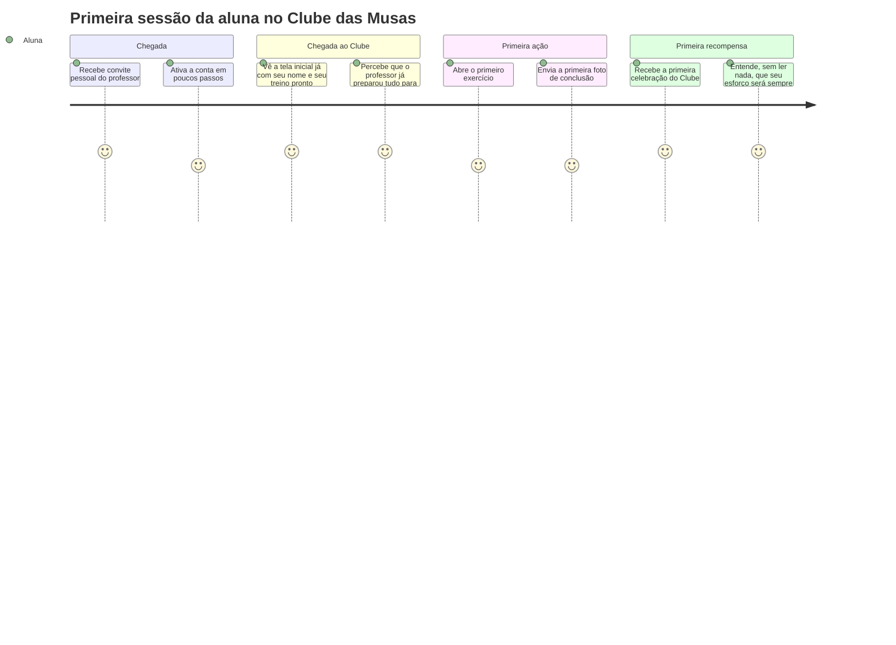
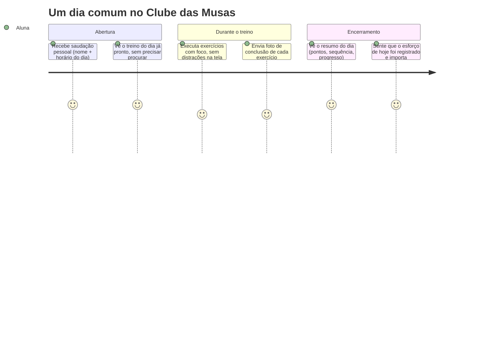

# ARQUITETURA DE EXPERIÊNCIA — CLUBE DAS MUSAS

## 0. Papel deste documento

Este documento não descreve tecnologia. Ele descreve **o que a usuária deve sentir** em cada momento da jornada — a camada emocional que a arquitetura técnica ([00_ARQUITETURA.md](00_ARQUITETURA.md)), o design system ([07_DESIGN_SYSTEM.md](07_DESIGN_SYSTEM.md)) e o mapa de telas ([11_MAPA_DE_TELAS_E_FLUXOS.md](11_MAPA_DE_TELAS_E_FLUXOS.md)) existem para sustentar.

Toda decisão de copywriting, timing de animação e hierarquia de informação tomada na implementação deve poder ser justificada por uma frase deste documento. Se uma tela é tecnicamente correta mas não produz a sensação aqui descrita, ela não está pronta.

---

## 1. A Sensação que a Marca Deve Transmitir

O nome "Clube das Musas" não é decorativo — é a tese central da experiência: a aluna não é uma usuária de um aplicativo de treino, ela é **membro de um clube que a escolheu e a acompanha**.

| Pilar                       | O que significa na prática, não como slogan                                                                                                                                                                        |
| --------------------------- | ------------------------------------------------------------------------------------------------------------------------------------------------------------------------------------------------------------------ |
| **Pertencimento**           | A aluna sente que entrou em algo, não que baixou um app. A linguagem é sempre "você e o Clube", nunca "o sistema e o usuário".                                                                                     |
| **Ser vista**               | Cada interação reconhece a aluna como indivíduo (nome, histórico, contexto), nunca como um registro genérico em uma lista.                                                                                         |
| **Orgulho, não pressão**    | A plataforma celebra esforço e constância. Ela nunca faz a aluna se sentir avaliada, cobrada ou insuficiente.                                                                                                      |
| **Sofisticação silenciosa** | A marca nunca grita para chamar atenção — luxo real é contido. Um recurso caro (fonte serifada, dourado, animação) usado com moderação vale mais do que ostentação constante.                                      |
| **Segurança emocional**     | Evolução física é um território vulnerável. A experiência precisa transmitir, o tempo todo, que esse espaço é seguro, privado e livre de julgamento — mesmo antes de a aluna ler qualquer política de privacidade. |

**Princípio-guia:** se uma tela poderia existir, sem nenhuma alteração, em qualquer aplicativo genérico de academia, ela ainda não está pronta para o Clube das Musas.

---

## 2. Primeira Experiência da Aluna

A primeira sessão decide se a aluna vai voltar amanhã. O objetivo emocional não é "ensinar a usar o app" — é fazê-la sentir que **já era esperada**.

### Regras específicas da primeira experiência

1. **Nada está vazio.** Quando a aluna entra pela primeira vez, o treino já está montado, a ficha já existe, o professor já deixou um recado de boas-vindas. A sensação é de chegar a um lugar preparado, não de montar algo do zero.
2. **Sem tour obrigatório.** Um tutorial forçado quebra a sensação de exclusividade — ninguém dá um manual de instruções a um membro de clube. A orientação acontece de forma contextual, no momento exato em que é necessária (ex.: a primeira vez que a aluna abre um exercício, o botão de enviar foto tem uma dica sutil e dispensável).
3. **O ranking espera.** Se a aluna entra em uma campanha no primeiro dia, sua posição no ranking não é o primeiro destaque — mostrar "você está em 34º lugar" no primeiro contato pune quem está apenas começando. O ranking aparece com naturalidade a partir da segunda ou terceira interação, quando já há progresso pessoal para ancorar a comparação.
4. **A primeira conquista é maior que as seguintes.** A primeira celebração (primeiro exercício concluído) recebe um tratamento mais elaborado que celebrações rotineiras futuras — é o momento que define a primeira impressão emocional da marca.

---

## 3. Jornada Diária

A experiência diária não deve parecer uma lista de tarefas. Deve parecer um encontro breve, positivo e esperado.

### Princípios da jornada diária

1. **A saudação nunca cobra, ela convida.** "Bora treinar, [Nome]?" — nunca "Você ainda não treinou hoje" com tom de alerta. A iniciativa deve parecer um convite ao clube, não uma notificação de pendência.
2. **Foco durante o treino.** A tela de execução de exercício minimiza elementos de navegação e gamificação — esses elementos voltam a aparecer no resumo, não durante o esforço. Ninguém quer calcular pontos no meio de uma série.
3. **Todo dia termina com um fechamento, não um vazio.** Ao concluir o último exercício disponível do dia, a aluna recebe um resumo (pontos ganhos, sequência atual, frase de reforço) — o dia tem um início e um fim narrativos, não apenas uma lista que esvazia.
4. **Um dia perdido nunca é tratado como uma falha.** Se a aluna falha em manter a sequência, a comunicação no dia seguinte é sempre voltada ao futuro ("Hoje é um novo dia para treinar"), nunca ao que foi perdido ("Você quebrou sua sequência de 12 dias"). A regra de negócio (zerar o contador em [03_REGRAS_DE_NEGOCIO.md](03_REGRAS_DE_NEGOCIO.md#3-regras-de-check-in)) é técnica; a comunicação com a aluna nunca usa linguagem de perda ou punição.

---

## 4. Momentos de Conquista

Cada tipo de conquista precisa de uma identidade emocional própria — uma celebração genérica repetida para tudo ("Parabéns!") se torna ruído e perde efeito rapidamente.

| Momento                                           | Frequência           | Tratamento emocional                                                                                                        |
| ------------------------------------------------- | -------------------- | --------------------------------------------------------------------------------------------------------------------------- |
| Primeiro exercício concluído                      | Uma vez              | O mais elaborado — define a primeira impressão da marca                                                                     |
| Conclusão do treino do dia                        | Diária               | Reforço breve e discreto — reconhecimento, não espetáculo                                                                   |
| Primeira semana de sequência (7 dias)             | Marco inicial        | Medalha exclusiva, com nome simbólico próprio, não apenas "Medalha 7 dias"                                                  |
| Subida de nível                                   | Recorrente, espaçada | Celebração em tela cheia breve, com um título simbólico (ex.: "Musa Dedicada") em vez de apenas um número                   |
| Desbloqueio de medalha                            | Recorrente           | Exibida imediatamente, mas com peso visual proporcional à raridade da medalha                                               |
| Recorde pessoal de sequência                      | Recorrente           | Comparação apenas com a própria história da aluna, nunca com outras alunas                                                  |
| Campeã de uma campanha                            | Ao fim da campanha   | Reconhecimento público (mediante autorização) no feed — o único momento em que a comparação social é o centro da celebração |
| Meta física alcançada (registrada pelo professor) | Pontual              | Tratada como conquista compartilhada entre aluna e professor, nunca apenas um dado atualizado                               |
| Aniversário de treino (1 ano)                     | Anual                | Retrospectiva narrativa da jornada, não uma lista de estatísticas                                                           |

**Princípio-guia:** quanto mais rara a conquista, maior o peso emocional permitido — conquistas frequentes usam reforço discreto para não gerar fadiga; conquistas raras merecem o momento de destaque que a moderação do dia a dia reserva para elas.

---

## 5. Princípios de UX Emocional

Estes princípios governam tom, linguagem e prioridade de informação — complementares às regras de interface já definidas em [07_DESIGN_SYSTEM.md](07_DESIGN_SYSTEM.md).

1. **Celebrar esforço e constância, nunca apenas estética corporal.** Em uma plataforma que lida com peso, medidas e percentual de gordura, o maior risco emocional é reforçar uma cultura de pressão estética. Toda celebração é ancorada em comportamento (treinar, ser constante, se dedicar) — nunca em julgamento de aparência.
2. **A aluna se compara com ela mesma antes de se comparar com as outras.** Progresso pessoal é sempre a primeira lente de leitura (evolução, sequência, pontos vitalícios); ranking e comparação social existem, mas em segundo plano.
3. **Nenhuma ação relevante fica sem resposta.** Silêncio do sistema é interpretado como indiferença — todo esforço da aluna gera algum sinal de reconhecimento, mesmo que discreto.
4. **A culpa nunca é uma ferramenta de motivação.** Nenhuma notificação, mensagem ou tela usa linguagem de cobrança, urgência artificial ou vergonha para trazer a aluna de volta.
5. **O professor é sempre o herói de apoio.** Gamificação e IA existem para fortalecer o vínculo da aluna com o professor, nunca para substituí-lo ou competir com sua presença — toda conquista relevante tem espaço para a voz do professor (recado, reconhecimento pessoal).
6. **Dados de evolução física são um espaço de confiança, não de exposição.** Antes mesmo de qualquer controle técnico de privacidade, a experiência precisa comunicar visualmente que aquele é um espaço só da aluna (e do professor que ela escolheu) — nunca uma vitrine pública por padrão.
7. **Simplicidade emocional:** a aluna nunca deve sentir que está sendo avaliada pelo sistema — apenas que está sendo acompanhada por ele.

---

## 6. Transformando Ações Comuns em Momentos Memoráveis

| Ação comum                                    | Tratamento genérico (o que evitar)                      | Como o Clube das Musas transforma                                                                                               |
| --------------------------------------------- | ------------------------------------------------------- | ------------------------------------------------------------------------------------------------------------------------------- |
| Concluir um exercício                         | Ícone de check estático                                 | Pequena animação em dourado + incremento visível de pontos em tempo real, com leve pausa dramática antes da recompensa aparecer |
| Concluir o treino do dia                      | Retorno direto à lista de exercícios                    | Tela de resumo do dia, com frase personalizada e métricas (pontos, sequência, progresso até a próxima medalha)                  |
| Enviar a primeira foto de evolução            | Upload silencioso                                       | Mensagem de acolhimento reforçando que aquele espaço é privado e será visto apenas pela própria aluna e pelo professor          |
| Completar a primeira semana                   | Nenhum tratamento especial                              | Medalha exclusiva com nome próprio + espaço reservado no feed, mediante autorização                                             |
| Subir de nível                                | Texto "Nível 5 alcançado"                               | Celebração em tela cheia breve, com título simbólico do novo nível, não apenas um número                                        |
| Bater uma meta física definida pelo professor | Atualização silenciosa de um número na tela de evolução | Transformada em conquista com narrativa própria, com espaço para o professor deixar um recado pessoal de reconhecimento         |
| Um ano de treino (aniversário)                | Nenhum destaque                                         | Retrospectiva visual condensada da jornada — uma pequena "história" da evolução, não uma lista de dados                         |
| Voltar após dias sem treinar                  | Notificação de cobrança                                 | Acolhimento — "Sentimos sua falta" em vez de "Você está atrasada", sem qualquer penalização visível na comunicação              |

### Técnicas de suporte a este princípio

- **Microcopy pessoal:** toda mensagem do sistema é escrita como se fosse dita pelo Clube à aluna, nunca como uma mensagem de sistema genérica. Usa o nome da aluna sempre que possível.
- **Timing como narrativa:** uma pequena pausa (fração de segundo) antes de revelar uma recompensa cria expectativa — recompensas instantâneas demais perdem peso emocional.
- **Variação de intensidade:** nem toda ação recebe o mesmo nível de celebração — reservar as celebrações mais elaboradas para os marcos reais é o que as mantém significativas (ver seção 4).
- **Progresso sempre visível:** a aluna deve conseguir ver, a qualquer momento, o quanto falta para a próxima medalha ou nível — isso mantém uma sensação constante de "estou quase lá", mesmo nos dias entre uma conquista e outra.
- **Linguagem de comunidade:** o uso da palavra "Musas" para se referir ao coletivo de alunas (ex.: "Você e outras Musas treinaram hoje") reforça pertencimento sem expor dados individuais de ninguém.

---

## 7. Nota Complementar: A Experiência Emocional do Professor

Embora o foco central deste documento seja a aluna, a tese de retenção (ver [02_MODELO_DE_NEGOCIO.md](02_MODELO_DE_NEGOCIO.md)) depende também de como o professor se sente ao usar a plataforma todos os dias.

O professor deve sentir que a plataforma **cuida do trabalho operacional para que ele possa focar no relacionamento humano com a aluna** — cada tela deve responder à pergunta "isso me aproxima da minha aluna ou me afasta dela em burocracia?". Um dashboard que exige interpretação é uma falha de experiência, mesmo que tecnicamente correto: o professor deve, em segundos, saber exatamente quem precisa de atenção hoje (aniversário, inadimplência, ausência) sem precisar procurar.

---

Este documento é a referência emocional obrigatória para toda decisão de copywriting, animação e priorização visual tomada durante a implementação. Qualquer tela que atenda aos requisitos funcionais de [03_REGRAS_DE_NEGOCIO.md](03_REGRAS_DE_NEGOCIO.md) mas não produza a sensação aqui descrita deve ser revisada antes de ser considerada concluída, conforme o processo definido em [PROMPT_MESTRE.md](PROMPT_MESTRE.md).
